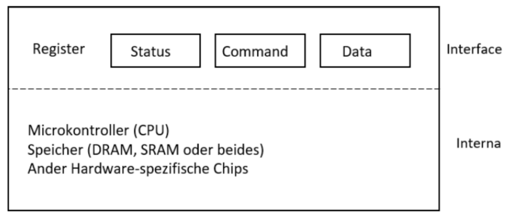

# Übungsaufgabe: Canocical Device Implementierung

In dieser Aufgabe implementieren Sie den Treiber für das Interfaces eines Canonical Devices, wie es in der Vorlesung vorgestellt wurde. 

Ihr Gerät verfügt über die drei Register Status, Command und Data. 

## Teilaufgabe 1: Interface Implementierung

Realisieren Sie das Interface über Felder. 

Das Feld `status` kann folgende Werte besitzen:

- busy: `01`
- ready: `00`
- error: `02`

Das Feld `command` kann folgende Werte besitzen: 

- idle: `00`
- read: `01`
- write: `02`
- reset: `04`
- delete: `08`

Die Felder `status`als auch `command` sind jeweils ein Byte groß. 

Das Feld `data` hat eine Länge von 20 Byte. 

## Teilaufgabe 2: Treiber Implementierung 

- Wird von Extern das Command-Register auf *write* gesetzt, liest der Treiber die Daten aus dem Data-Register und schreibt diese in den internen Speicher 
- Der interne Speicher in Ihrem Gerät soll 1.024 Byte betragen. 
- Die Daten werden in Ihrem Gerät fortlaufend in den internen Speicher geschrieben. Ist der Speicher voll wird der Status auf *error* gesetzt. 
- Wird von Extern das Command-Register auf *read* gesetzt, liefert der Treiber die Daten. Die DAten werden dabei fortlaufend geschrieben. 
- Wird zwischen Lese- und Schreibvorgang gewechselt, startet der Lese- bzw. Schreibvorgang immer am Anfang Ihrer internen Datenstruktur (also bei Adresse 0). 
- Wird das Command-Register auf *reset* gesetzt, startet sowohl Lese- als auch Schreibvorgang wieder bei der Adresse 0. 
- Wird von Extern das Command-Register auf *delete* gesetzt, löscht das Gerät sämtliche gespeicherte Daten.

## Teilaufgabe 3: Aufrufer Implementieren 

- Implementieren Sie eine Main-Funktion, die in Ihr Gerät 512 Byte Daten schreib, danach wird der gesamte Speicherinhalt aus dem Gerät ausgelesen und ausgegeben werden.
- Setzen Sie nun das Gerät zurück und und schreiben Sie nun 2048 Byte in Ihr Gerät, danach soll der Inhalt des Gerätes ausgelesen und ausgegeben werden.
- Löschen Sie nun den Inhalt des Gerätes und schreiben 256 Byte in Ihre Gerät. danach wird der gesamte Speicherinhalt aus dem Gerät ausgelesen und ausgegeben werden.

## Voraussetzungen

Nutzen Sie hierfür [gcc](https://gcc.gnu.org/).

Sie können *gcc* unter Linux und/oder macOS direkt verwenden. Unter Linux installieren Sie *gcc* über Ihren Paket-Manager, unter macOX über [Homebrew](https://brew.sh/).

Nutzen Sie Windows 10 können Sie entweder eine Linux in einer virtuellen Maschine (z.B. in [VirtualBox](https://www.virtualbox.org/)) nutzen, oder direkt das [Windows Subsystem for Linux (WSL 2.0)](https://docs.microsoft.com/en-us/windows/wsl/install-win10) nutzen. Alternativ ist es möglich *Windows Subsystem for Linux* über den Windows App Store zu installieren.

In der Wahl der Linux Distribution sind sie frei, alle Beispiele in der Vorlesung werden jedoch unter Ubuntu (letzter stabiler Release) bewertet und eventuell vorgestellt. 

## Abgabe

Die Bewertung Ihrer Abgabe findet automatisch statt. Stellen Sie hierzu folgende Punkte sicher:

* Ihre Implementierung befindet sich in einer Datei mit dem Namen **stack.c**. 
* Sie nutzen eine Header-Datei in der der obige Header hinterlegt ist. 
* Zur Abgabe erhalten Sie einen Zugang zum hochschulinternen [GitLab](https://git.it.hs-heilbronn.de/).
* Ihre Lösung checken Sie in Ihrem Repository ein.
* Die eigentliche Abgabe erfolgt über das hochschuleigene [Commit-System](https://commit.it.hs-heilbronn.de/). Der Zugriff ist ausschließlich im Hochschulnetz oder über VPN möglich. 

## Bewertung

* Die Bewertung Ihrer Aufgabe findet anhand einer Reihe von automatisierten Tests statt. 
* Hierzu ist es erforderlich, dass die obigen Schritte exakt eingehalten werden. 
* Ihr Implementierung wird einer Reihe von automatisierten Tests unterzogen, die Ihre Implementierung auf Korrektheit überprüfen. 
* Abgaben, die nicht vollständig sind oder die Abgabekriterien nicht erfüllen werden nicht bewertet. 
* Abgaben, die nicht fristgerecht eingereicht werden, werden nicht bewertet. 
* Nutzen Sie zur Abgabe ausschließlich das beschriebene Verfahren. Abgaben, die per E-Mail oder anderen Wegen eingereicht werden, werden nicht bewertet. 
* Abgaben, die aufgrund eines Fehlers nicht durch die Tests laufen, werden entsprechend mit weniger Punkten bewertet.
