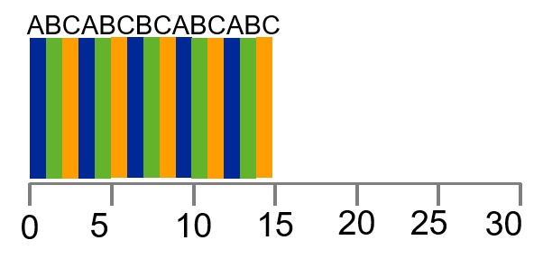

---

marp: true
theme: defalut
paginate: true
footer: 

---

# Scheduler 
## Teil 1: CPU-Scheduling 
Prof. Dr.-Ing. Andreas Heil

 Licensed under a Creative Commons Attribution 4.0 International license. Icons by The Noun Project.

v1.0.0

---

# Lernziele und Kompetenzen

* Grundlagen der Scheduling-Mechanismen **kennen lernen** 
* **Verstehen** wie Prozesse von Betriebssystemen »gescheduled« werden können

---

# Eine kurze Wiederholung

Bisher kennen gelernt:

* »Low-Level-Mechanismen« von laufenden Prozessen (z.B. Context Switch)
* Falls nicht klar, Einheit 1 wiederholen + Kapitel 4-6 aus *Operating Systems: Three Easy Pieces*[^1] wiederholen

Was fehlt noch? 
* Wann darf welcher Prozess laufen (engl. scheduling)

---

# Scheduling Policy

* Die »Scheduling Policy« (also das Regelwerk) hängt vorrangig vom »Workload« der Prozesse ab
* Zur Vereinfachung werden zunächst folgende (absolut unrealistische) Annahmen getroffen:
    * Jeder Job läuft gleich lang
    * Alle Jobs treffen zur gleichen Zeit ein
    * Einmal gestartet, läuft ein Job bis er beendet ist
    * Alle Jobs verwenden ausschließlich die CPU
    * Laufzeit (engl. runtime) eines jeden Jobs ist bekannt1

---

# Scheduler Metriken: Turnaround-Zeit

* Hinweis: Metriken werden im 4. Semester ins SEKS vertieft 
* Für heute genügt: Metrik = einfach um etwas zu messen
* Für uns: zunächst nur eine Metrik

$$
𝑇_{𝑡𝑢𝑟𝑛𝑎𝑟𝑜𝑢𝑑}=𝑇_{𝑐𝑜𝑚𝑝𝑙𝑒𝑡𝑖𝑜𝑛}−𝑇_{𝑎𝑟𝑟𝑖𝑣𝑎𝑙}
$$

Aufgrund unserer vorherigen Annahmen gelten
* Alle Jobs kommen zum  gleichen Zeitpunkt an: $T_{turnaround} = 0$
* Somit gilt: $T_{turnaround}=T_{completion}$

---

# First In, First Out (1)

First in, First out (abk. FIFO) oder manchmal auch First Come, First Serve (abk. FCFS)
* Einfach und daher auch einfach zu implementieren
* Beispiel
    * Jobs A, B und C kommen kurz nacheinander an
    * Jeder Job hat eine Laufzeit von 10 Sekunden
    * Was ist die durchschnittliche Turnaround-Zeit?
    * $\frac{10+20+30}{3}=20$

---

# First In, First Out (2)

* Heben wir jetzt die erste Annahme auf
    * Zur Erinnerung: Jeder Job läuft gleich lang
    * Ab sofort: Jeder Job läuft eben nicht mehr gleich lang
    * Gibt es einen Workload, der FIFO »alt aussehen lässt«?
    * $\frac{100+110+120}{3}=110$

---

# Convoy Effect (dt. Konvoieffekt)

* Kennt jeder
* Mehrere Kunden mit wenigen Waren warten hinter einem einzigen Kunden mit vielen Waren 
* Nur eine Supermarktkasse offen, der Kunde vor Ihnen hat zwei Einkaufswägen voll und zählt bereits das Kleingeld... 😤

[1]

---

# Shortest Job First

* Shortest Job first (Abk. SJF)
* Beschreibt die Policy recht treffend 
    * Führt den kürzesten Job aus, dann den zweit kürzesten etc.
* Beispiel von zuvor
    * SJF reduziert Turnaround-Zeit von 110 auf 50 
* $\frac{10+20+120}{3}=50$

---

# Problem bei SJF

* Lösen wir ab jetzt die Restriktion, dass alle Jobs zum selben Zeitpunkt eintreffen
* Beispiel: A trifft bei $𝑡=0$, B und C bei $𝑡 = 10$ ein
* Turnaround-Zeit hat sich hierdurch verdoppelt
* $\frac{100+(110-10)+(120-10)}{3}=103,33$

---

# Exkurs: Non-Preemptive vs. Preemptive 

* Non-Preemptive 
    * Stammt aus den Zeiten von sog. Batch-Systemen
    * Jeder Job wurde zu Ende gerechnet, bevor überhaupt in Erwägung gezogen wurde einen anderen Job zu starten 

* Preemptive
    * Alle modernen Betriebssysteme sind »preemptive«
    * Jederzeit gewillt einen Job zu stoppen und einen anderen dafür zu starten
    * Nutzen den zuvor behandelten Context Switch

---

# Shortest Time-to-Completion First (STCF)

* SJF ist non-preemptive ▶ versuchen wir es preemptive
* Lösen wir nun die Restriktion, dass alle Jobs bis zum Ende durchlaufen 
* Jedes Mal wenn ein Job eintrifft, wird derjenige der die geringste Restlaufzeit
* **Achtung!** Das geht nur wegen unserer letzten noch bestehenden Annahme: Die (Rest-)Laufzeit ist bekannt! 
* $\frac{(120-0+(20-10)+(30-10)}{3}=50$

---

# Problem mit STCF

* Benutzer sitzt vor dem Rechner und wartet bis Job A (z.B. Aktualisierung in Excel o.ä.) fertig ist
* Nun kommt die Hausaufgabe vom letzten Mal ins Spiel: Sie erinnern sich an den Unterschied zwischen Foreground- und Background-Jobs?  
* Was ist denn, wenn andauernd neue kürzere Jobs eintreffen, die keine Benutzereingabe erfordern… 🥱

[2]

---

# Scheduler Metriken: Antwortzeit

* Zweite Metrik für heute: Antwortzeit (eng. response time)
* Dauer vom Zeitpunkt an dem Job eintrifft bis er das erste Mal »gescheduled« wird
* $\frac{0 + 5 + 10}{3}=5$

$$
T_{response}=T_{firstrun}-T_{arrival}
$$

---

# Round Robin (RR)

* Grundprinzip: Jeder Job wird nur für eine bestimmte Zeitspanne (engl. time slice) ausgeführt 
* Zeitscheibe ist ein Vielfaches vom Timer Interrupt (d.h. bei einem Timer Interrupt von 10ms ein Vielfaches von 10)
* Durchschnittliche Antwortzeit im Vergleich zu SJF (vorherige Folie) ist 1
* $\frac{0 + 1 + 2}{3}=1$

---

# Round Robin (Forts.)

* Der Context Switch kostet Ressourcen
* D.h. wie lange müssten die Time Slices sein, dass sich ein Context Switch überhaupt lohnt?
* Für Antwortzeit hervorragend geeignet, für Turnaround-Zeit überhaupt nicht
* Round Robin zieht Ausführungsdauer in die Länge, in manchen Fällen ist die Ausführung sogar schlechter als FIFO  
* Allgemein lässt sich festhalten: Jede Policy die fair ist, d.h. die CPU auf Prozesse aufteilt, führt zu einem schlechten Ergebnis in Bezug auf Turnaround-Zeit 

---

# Kurzer Zwischenstand

* Wir haben zwei Typen von Schedulern kennen gelernt 
    * SJF/STCF optimiert Turnaround-Zeiten, ist jedoch ungünstig für Antwortzeiten 
    * RR optimiert die Antwortzeit, ist aber ungünstig für die Turnaround-Zeit

* Es gibt noch zwei Annahmen/Restriktionen, die »aufgelöst« werden müssen
    4. Alle Jobs verwenden ausschließlich die CPU
    5. Laufzeit eines jedes Jobs ist bekannt

---

# Input/Output

* Lösen wir die nächste Restriktion: Ab sofort können Jobs auch I/O-Operationen aufrufen
* Scheduler muss nun entscheiden wann eine I/O-Operation durchgeführt wird, da in der Zeit der laufende Prozess die CPU nicht nutzen kann und sich somit im Status »blocked« befindet
* Scheduler kann demnach in dieser Zeit einen anderen Job laufen lassen
* Ist die I/O-Operation fertig (wird über Interrupt angezeigt), wird der zuvor geblockte Job wieder auf »ready« gesetzt
* Ab jetzt kann er Job potentiell wieder laufen

---

# Overlapping

* Schlechte Ressourcen-Nutzung
    

* Bessere Ressourcen-Nutzung dank Overlapping

---

# Kein Wissen über Prozessdauer

* Als letzte Restriktion lösen wir nun die Kenntnisse über die Prozesslaufzeit auf 
* D.h. der Scheduler weiß nichts über die Restlaufzeit eines Prozesses
* Wie kann dann sinnvoll gescheduled werden? 

Lösungsidee: sog. »Multi-Level Feedback Queue«-Ansätze verwenden die nahe Vergangenheit, um die Zukunft vorauszusagen! 🤩

---

# Referenzen 

[^1]: http://pages.cs.wisc.edu/~remzi/OSTEP/

--- 

# Bildnachweise

[1] Photo by Paul Townsend, licensed under Attribution-ShareAlike 2.0 Generic (CC BY-SA 2.0)
[2]	Bild von Gerd Altmann auf Pixabay 

