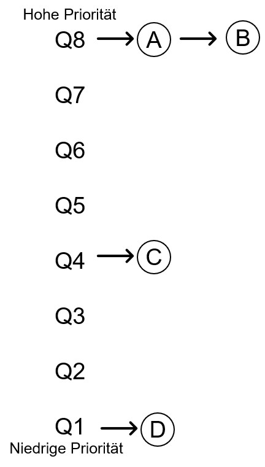
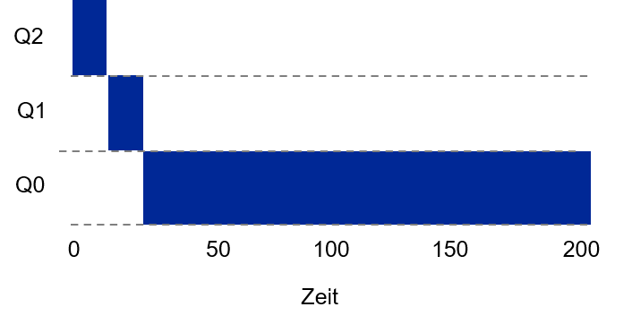
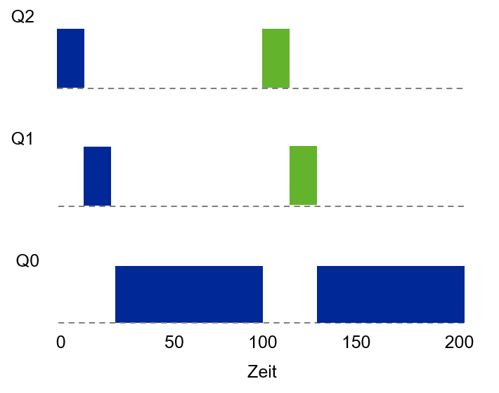
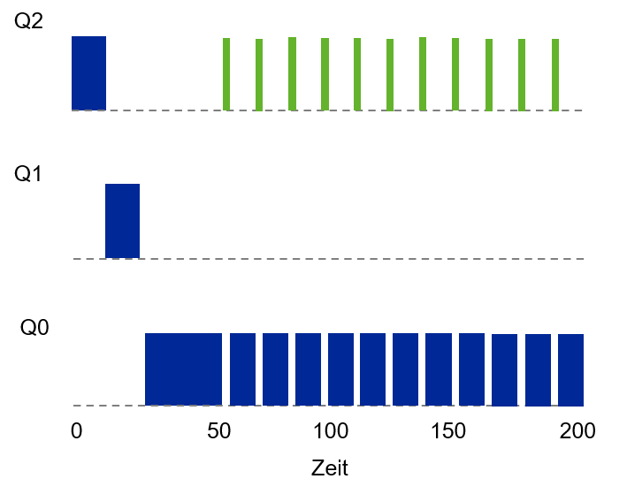
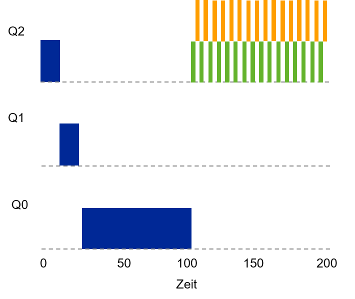
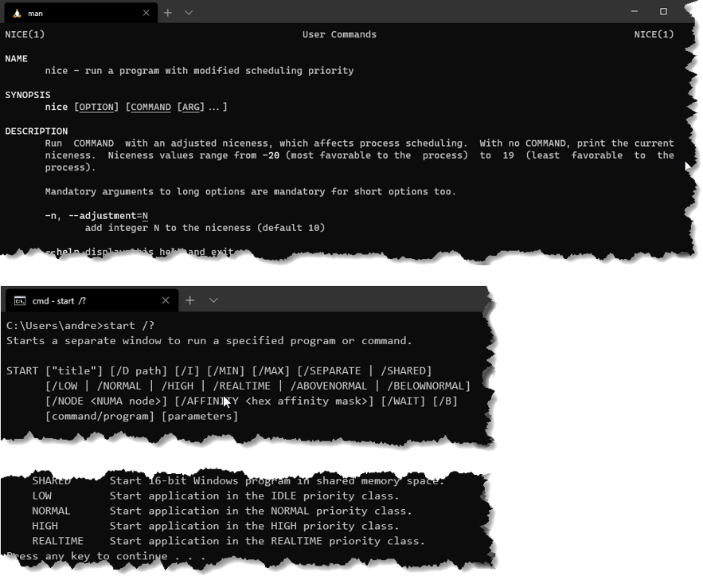

---

marp: true
theme: defalut
paginate: true
footer: 

---

# Scheduler 
## Teil 2: Multi-Level Feedback Queue
Prof. Dr.-Ing. Andreas Heil

 Licensed under a Creative Commons Attribution 4.0 International license. Icons by The Noun Project.

v1.0.0

---

# Lernziele und Kompetenzen

* Grundlagen des Scheduling-Verfahrens mit Multi-Level Feedback Queues **kennen lernen** 

---

# Wiederholung

* Zuletzt wurde die Annahme fallen gelassen, dass wir die Laufzeit eines Prozesses im Vorhinein wissen
* Wie kann ohne diese Kenntniss ein Scheduler gebaut werden, er sowohl Antwortzeiten (z.B. für interaktive Anwendungen) als auch die Turnaround-Zeiten (d.h. ein Job möglichst schnell fertig stellen) ohne Wissen über die Laufzeit eines Prozesses minimiert?

---

# Lösungsidee: Multi Level Feedback Queue (MLFQ)

Grundlegende Regeln
* MLFQ hat mehrere Queues, jede mit einem Prioritäts-Level
* Jobs mit höherer Priorität laufen zuerst (=höhere Queue)
* Falls sich mehrere Jobs in der gleichen Queue befinden gilt:
    * Regel 1: `If Priority(A) > Priority(B), A runs (B doesn‘t)`
    * Regel 2: `If Priority(A) == Priority(B), A & B run in Round Robin`
* Wie wird jedoch die Priorität für ein Job festgelegt?
    * Priorität  nicht fix, sondern hängt vom **beobachteten Verhalten** des Jobs ab
* Wenn die ganze CPU-Zeit auf A und B verteilt wird, wie kommen dann aber C und D zum Zug? 

---

# MLFQ Beispiel

---

# 1. Versuch - Prioritäten ändern

* Workload Betrachtung: Mischung aus...
    * interaktiven Jobs, die kurz laufen, geben CPU schnell wieder frei und
    * langlaufende Jobs, die die CPUintensiv in Anspruch nehmen, aber deren Antwortzeit »nicht relevant« ist. 

* Zusätzliche Regeln:
    * Regel 3: Ein neu eintreffender Job erhält immer die höchste Priorität (oberste Queue)
    * Regel 4a: Wenn ein Job die gesamte Zeitscheibe aufbraucht, wird seine Priorität herabgestuft (d.h. eine Queue nach unten geschoben)
    * Regel 4b: Wenn ein Job die CPU vor Ablauf der Zeitscheibe freigibt, bleibt er auf der gleichen Priorität (d.h. bleibt in der aktuellen Queue)

--- 

# Beispiel 1: Ein langlaufender job 

* Job läuft immer bis ans Ende der Time Slice 
* Nach jeder Time Slice wird der Job heruntergestuft
* Am Ende läuft der Job auf der niedrigsten Priorität

---

# Beispiel 2: Ein zusätzlicher »Kurzläufer«

* Bei $𝑇 = 100$ trifft ein zweiter, kurzlaufender Job ein
* MLFQ trifft immer die Annahme, dass ein neuer Job ein »Kurzläufer« ist 

---

# Beispiel 3: Zusätzliche I/O

* Mischung aus I/O-intensivem und CPU-intensivem Job
* Nach Regel 4 bleibt der Job, der die CPU schnell freigibt, weil er z.B. auf die Tastatur wartet, hoch priorisiert
* Wer sieht denn das Problem?

---

# Game the Scheduler

* Programm so schreiben, dass es kurz vor Ablauf der Zeitscheibe einen Dateizugriff ausführt (die Datei selbst ist uns komplett egal)
* Programm bleibt hoch priorisiert, da Zeitscheibe nicht vollständig aufgebraucht
* Machen wir das immer bei ≈ 99% der Zeitscheibe, könnten wir die CPU 99% übernehmen
* Langlaufende Jobs bleiben auf der Strecke (engl. starvation)
* Job A kommt nie mehr in eine bessere Queue, selbst wenn sich sein Verhalten ändert 

---

# Game the Scheduler

Wie könnten wir das besser machen?

---

# Versuch 2: Priority Boost

* Neue Regel
    * Regel 5: Nach definierten Zeit *s* werden alle Jobs wieder in die oberste Queue verschoben

* Regel 5 löst zwei Probleme:
    * Prozesse laufen nicht mehr Gefahr der »Starvation«
    * Wenn ein Job »plötzlich« interaktiv würde, kann er entsprechend priorisiert werden (s. nächste Seite)

---

# Voodoo Constant 

Spannende Frage: Wie lange sollte die Zeitspanne *s* sein?

* Der Wert *s* heißt nach John Ousterhout »Voodoo Constant«.
* Für die Bestimmung sog. Voodoo-Konstanten benötigt das System etwas »schwarze Magie« zu deren Bestimmung
* Dilemma: Wenn *s* zu groß gewählt wird, können CPU-intensive Jobs doch verhungern, ist sie zu klein gewählt bekommen interaktive Jobs nicht genügend CPU  
* Genrell sollten Voodoo-Konstanten vermieden werden (Ousterhout's Law)

---

# Versuch 3: Verbesserte Buchführung

* Problem: Regel 4a und 4b ermöglichen immer noch, dass der Scheduler ausgespielt wird 
* Lösungsidee: Eine verbesserte Buchführung
* Merken wie viel Zeit ein Prozess in einer Queue verbracht hat
* Sobald ein Prozess kumuliert eine Zeitscheibe aufgebraucht hat, wandert er eine Queue nach unten
* Aus den Regeln 4a und 4b wird
    * Regel 4: Sobald ein Job seine gesamte Zeit auf einer Prioritätsebene genutzte hat (ungeachtet dessen, wie viel Zeit er der CPU  »zurück gibt«), wird seine Priorität reduziert (d.h. er wandert eine Queue nach unten). 

---

# Tuning und MLFQ Probleme 

* Wie sollte MLFQ priorisiert werden?
* Wie viele Queues 
* Wie groß sollte die Zeitspanne (engl. time slice) pro Queue sein?
* Machen unterschiedliche Time Slices pro Queue Sinn?
* Wie oft findet Priority Boost statt?

---

# MLFQ Regeln 

* **R 1**: If Priority(A) > Priority(B), A runs (B doesn’t)
* **R 2**: If Priority(A) = Priority(B), A & B run in round-robin fashion using the time slice (quantum length) of the given queue.
* **R 3**: When a job enters the system, it is placed at the highest priority (the topmost queue).
* **R 4**: Once a job uses up its time allotment at a given level (regardless of how many times it has given up the CPU), its priority is reduced (i.e., it moves down one queue).
* **R 5**: After some time period *s*, move all the jobs in the system to the topmost queue. 

--- 

# Wird MLFQ überhaupt irgendwo verwendet?

* Solaris
    * MLFQ *Time-Sharing Scheduling Class* wird über eine Reihe von Tabellen konfiguriert
    * Diese können durch einen Admin angepasst werden 😱
    * 60 Queues, mit langsam steigenden Time Slices von 20 ms bis zu 1 Sekunde 

* FreeBSD 
    * Scheduler nutzt Formel um Priorität eines Jobs zu berechnen
    * Wie viel CPU hat der Prozess schon verbraucht + wie ist  der Verbrauch abgefallen (sog. Decay-Usage Algorithms)

---

# Be Nice 

* Unix Betriebssysteme nehmen »Hinweise« von Nutzern und Administratoren bzgl. der Priorisierung von Jobs entgegen. 
* Unter Windows kann man beim Start eines Prozesses mittels `start` die Priorität des Prozesses angeben
* Hausaufgabe: Machen Sie sich mit dem Befehl `nice` (Linux) und `start` (Windows) vertraut

---

# Referenzen 

---

# Bildnachweise