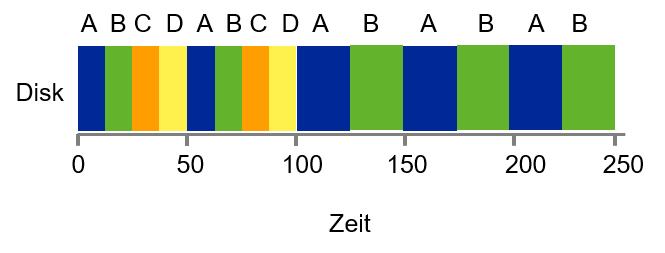
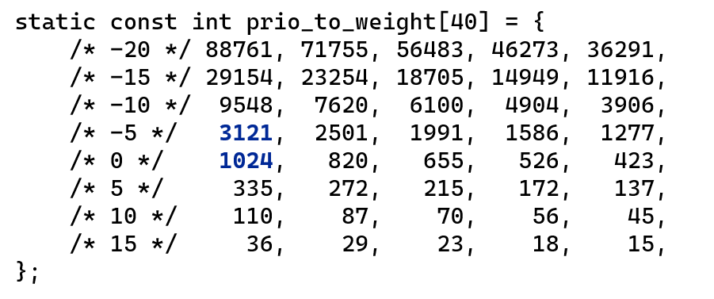

---

marp: true
theme: defalut
paginate: true
footer: 

---

# Scheduler 
## Teil 3: Lottery Scheduling
Prof. Dr.-Ing. Andreas Heil

 Licensed under a Creative Commons Attribution 4.0 International license. Icons by The Noun Project.

v1.0.0

---

# Lernziele und Kompetenzen

* Grundlagen des Lottery-Scheduling-Verfahrens **kennen lernen** 

---

# Proportional / Fair Share Scheduler

* Anstelle Turnaround-Zeiten zu optimieren, versuchen Fair Share Scheduler sicherzustellen, dass jeder Job einen gewissen Prozentsatz der CPU-Ressourcen erhält

* Beispiel: Lottery Scheduling
* Grundidee: Es werden Tickets vergeben, die wie in einer Lotterie gezogen werden
* Prozesse, die öfters laufen sollen, erhalten schlicht mehr Lotterielose… 

Einfach, oder? 🤔

---

# Grundkonzept: Tickets represent your share

* Grundlegendes Konzept: Es werden Tickets vergeben (entsprechen einem CPU Share)
* Beispiel:
    * Job A erhält 75% der Tickets (hier: Lose 0..74)
    * Job B erhält  25%  der Tickets (hier: Lose 75..99)
    * Scheduler muss nun wissen, wie viele Lose es insgesamt gibt (hier: 100)
    * Gewinnerticket gibt an, welcher Prozess läuft

---

# Lottery Scheduler - Überlegungen

* Statistische Annäherung an gewünschte Aufteilung 
* Je länger die Jobs laufen, desto besser ist die Annäherung 
* Was ist bei einer Verteilung 99% zu 1%?
* Man benötigt einen guten Zufallsgenerator
* Was macht man wenn ein neuer Job dazu kommt? 

---

# Ticket Währung

User mit mehreren Tickets, kann diese einer eigene »Währung« zuordnen 

* Beispiel
    * A und B haben je 100 Tickets 
    * A hat zwei Jobs, A1 und A2, jeder Job bekommt 500 (von insg. 1.000) User Tickets in A‘s Währung 
    * B hat 1 Job B1, dieser bekommt 10 von 10 (User Tickets) in B‘s Währung
    * System konvertiert A‘s Tickets pro Job zu je 50 Tickets in der Systemwährung
    * System konvertiert B‘s Ticktes zu 100 Tickets in Systemwährung

---

# Ticket Transfer

Prozess kann temporär Tickets auf einen anderen Prozess übertragen

* Beispiel: 
    * Client-Server Mechanismus (lokal)
    * Client, der eine Anfrage von einem Server wartet, kann seine Tickets dem Server geben, um die Antwort zu beschleunigen 
    * Nach Beendigung gibt der Server die Tickets an den Client zurück 

---

# Linux Completely Fair Scheduler (CFS)

* Problem: Scheduling kann bis zu 5% der CPU-Ressource ausmachen 
* CFS führt eine virtual runtime (*vruntime*) ein
* Jeder Prozess, der läuft, sammelt *vruntime* an
Bei Scheduling-Entscheidung wählt der Scheduler den Prozess mit der geringsten vruntime aus

---

# CFS: Wie oft sollte ein Prozess gewechselt werden?

* *sched_latency*
    * Time Slice Dauer, typischerweise 48ms 
    * Wird durch Anzahl der Prozesse *n* geteilt
    * Ergibt die Zeitscheibe pro Prozess
    * Somit ist die Zeitverteilung vollständig fair 

* *min_granularity*
    * Mindestdauer, typischerweise 6ms
    *  Dieser Wert wird niemals unterschritten (Bsp. 10 Prozesse ergäbe 4,8ms pro Prozess)

* CFS nutzt regelmäßige Timer Interrupts, der Scheduler kann Entscheidungen also immer nur zu fixen Zeitpunkten treffen

---

# CFS - Beispiel

* Vier Jobs (A,B,C,D), wobei C, D und E kurz nach A eintreffen
* Nach der ersten Zeitscheibe wird einer der Jobs aus (B,C,D) gewählt da hier vruntime < vruntime
* Nach *t = 100* sind C und D fertig, danach wird die vruntime zwischen A und B aufgeteilt 

---

# CFS - Weighting / Niceness

CFS ermöglicht die Angabe von Prioritäten, damit Prozesse mehr CPU-Ressourcen erhalten können. 
* In UNIX entspricht das dem »nice level«
* Kann zwischen -20 und + 19 gesetzt werden
* 0 ist Standardwert
* < 0 höhere Prio, > 0 kleinere Prio

---

# CFS: Zeitscheibe berechnen

* Gewichtungen erlauben es die Zeitscheibe pro Prozess zu berechnen:

$$
time\_sclice_k = \frac{weight_k}{\sum\limits_{i=0}^{n}weight_i}\cdot sched\_latency
$$

* Beispiel:
    * 2 Prozesse A (Prio=-5), B (Prio=0)
    * $𝑤𝑒𝑖𝑔ℎ𝑡_𝐴$  = 3121, $𝑤𝑒𝑖𝑔ℎ𝑡_𝐵$=1024    
    * A erhält 36ms, B erhält 12ms

---

# prio_to_weight

---

# CFS: vruntime berechnen

* Berechnet wieviel Laufzeit ein Prozess imVerhältnis zur Gewichtung genutzt hat

$$
vruntime_i = vruntime\cdot \frac{weight_0}{weight_i} \cdot runtime_i
$$

* Hinweis:
    * Gewichtung bleibt im Verhältnis gleich, wenn andere Prioritäten gewählt werden
    * Annahme A hat 5 und B hat 10
    * A und B werden noch im selben Verhältnis wie zuvor gescheduled

---

# CFS Prozesslisten

* Problem: Bei mehreren hundert oder gar 1.000 Prozessen, wie wird der nächste Prozess gefunden?
* Kurzes Gedankenspiel: Skalieren Listen? Hier müssten man immer aller linear durchsuchen was in einem linearen Aufwand von $𝑂(𝑛)$ resultiert.  
* Lösung: Geschickte Wahl der Datenstruktur:
    * CFS speichert Prozesse in Rot-Schwarz-Bäumen (ausgeglichener Baum)
    * Algorithmen auf Rot-Schwarz-Bäumen sind logarithmisch mit einem Aufwand von $𝑂(l𝑜𝑔_𝑛)$ 

* Deswegen: Algorithmen und Datenstrukturen

---

# CFS und I/O

* Was passiert eigentlich wenn ein Prozess A permanent läuft , weil B aufgrund einer I/O-Operation blockiert (z.B. 10s)?
* B wacht auf und hat die niedrigste vruntime (10s kleiner als bei A)
* B würde nun die CPU für 10s monopolisieren, »Starvation« von A wäre potentiell möglich

* Lösung: CFS setzt die vruntime zurück
    * Sobald ein Job aufwacht, erhält er den Minimum Wert im Baum (Liste aller laufende Jobs)
    * »Starvation« wird vermieden
    * Nachteil: Jobs, die nur kurz schlafen, bekommen hierdurch keinen fairen Anteil   

---

# Abschluss

* Am Beispiel des CFS sieht man, dass die Wahl einer geeigneten Datenstruktur eine signifikante Auswirkung auf ein System haben kann 
* Deswegen macht es durchaus Sinn, sich mit dem Thema *Algorithmen und Datenstrukturen* in SEB3 auseinanderzusetzen. 

---

# Referenzen 

[1]	By Cburnett - Own work, CC BY-SA 3.0, https://commons.wikimedia.org/w/index.php?curid=1508398

---

# Bildnachweise

