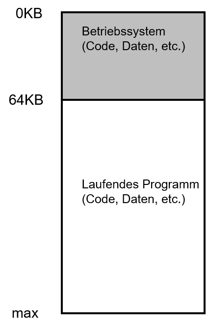
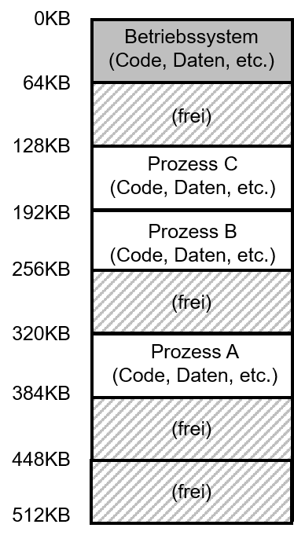
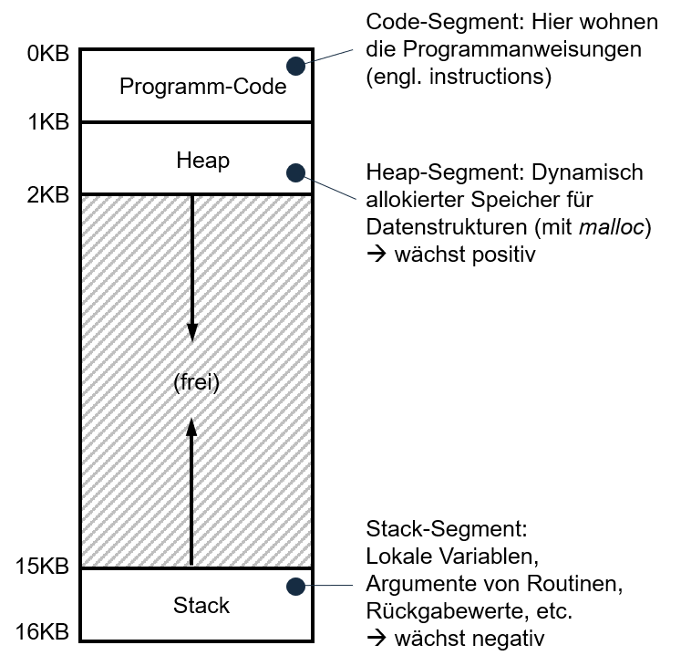

---

marp: true
theme: defalut
paginate: true
footer: 

---

# Speicher 
## Teil 1: Adressraum
Prof. Dr.-Ing. Andreas Heil

 Licensed under a Creative Commons Attribution 4.0 International license. Icons by The Noun Project.

v1.0.0

---

# Lernziele und Kompetenzen

* Grundlagen von Adressräume und Speichervirtualisierung **kennen lernen**

---

# Damals...

Am Anfang war alles viel einfacher…
* Betriebssystem war (vollständig) im Hauptspeicher präsent
* Ein laufendes Programm (= Prozess) konnte den Rest des Speichers nutzen
* Einfach zu programmieren

---

# Einfache Speicherverteilung

Beispiel: 
* Betriebssystem im Speicherbereich 0KB bis 64KB
* Das laufende Programm nutzt den gesamten restlichen Speicher ab 64KB

---

# Mehrere Prozesse

Bereits gelernt: 
* Prozesse können vom Betriebssystem »gescheduled« werden 
* Jeder Prozess hat einen eigenen Speicherinhalt 
* Im Beispiel vorher muss der Speicherinhalt bei jedem Context Switch weggespeichert und neu geladen werden

---

# Speicher aufteilen? 

Lösungsidee:
* Jeder Prozess bekommt einen Teil vom Speicher

Fragen:
* Wie kann ich den Zugriff auf den Speicherbereich schützen? 
* Was machen wir mit dem freien Speicher?
* Was wenn nur noch viele kleine Speicherbereiche frei sind?

---

# Die Lösung: Adressräume

* Einfach zu verwendende Abstraktion des Speichers
* Ein Adressraum (engl. address space) beinhaltet alle Bestandteile des laufenden Programms

---

# Aufbau von Addressräumen

* Code
    * Einfach zu laden, da nicht veränderbar
* Stack und Heap
    * Wachsen und schrumpfen
    * Durch entgegengesetzte Anordnung (s.r.) ist dies 	   	gleichzeitig möglich  

    

---

# Speichervirtualisierung

* Prozess »denkt« er wurde bei Adresse 0 KB in den Speicher geladen
* Allerdings liegt der Prozess dabei jedoch wo ganz anders
* Hier sprechen wir von einer sog. virtuellen Adresse (engl. virtual address)

---

# Ziele der Speichervirtualisierung

* Transparenz: Der Prozess weiß nichts von seinem Glück und denkt er greift auf physikalischen Speicher zu 
* Effizienz: In Bezug auf Speicher- als auch Zeit (z.B. unterstützt durch Hardware-Features)
* Sicherheit: Prozess müssen voreinander geschützt sein

---

# Referenzen 

---

# Bildnachweise

