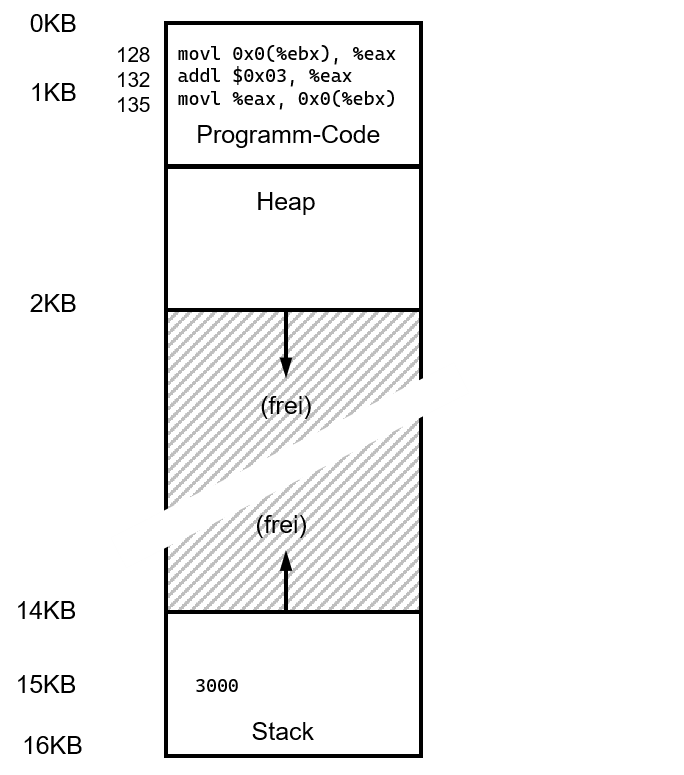
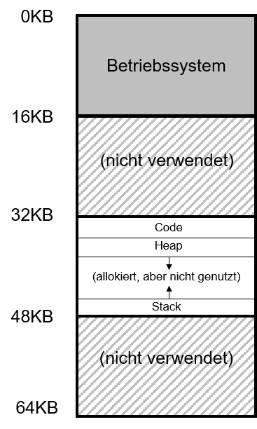

---

marp: true
theme: defalut
paginate: true
footer: 

---
<style>
img[alt~="center"] {
  display: block;
  margin: 0 auto;
}
</style>
# Speicher 
## Teil 3: Address Translation
Prof. Dr.-Ing. Andreas Heil

 Licensed under a Creative Commons Attribution 4.0 International license. Icons by The Noun Project.

v1.0.0

---

# Lernziele und Kompetenzen

* Funktionsweise einer MMU **verstehen** und einfache Adressberechnungen selbst **durchführen können**

---

# Hardware-basierte-Address-Translation

* Jeder Zugriff auf den virtuellen Adressraum wird durch die Hardware übersetzt 
* Virtuelle Adresse wird dabei in physikalische Adresse umgewandelt
* Aufgabe des Betriebssystems
  * Verwaltung des Speichers (engl. memory management)
  * Verwaltung der freien Speicherbereiche 

Annahmen zum Einstieg:
* Annahme 1: Adressraum ist kleiner als der physikalische Speicher
* Annahme 2: Jeder Adressraum ist gleich groß

---

# Code-Beispiel

Code-Beispiel, das einen Wert aus dem Speicher liest, um drei erhöht und wieder zurück schreibt.

C-Code: 

```c
void func() {
  int x = 3000; // thanks, Perry.
  x = x + 3;    // line of code we are interested in
  ...
}
```

x86-Code:
```
128: movl 0x0(%ebx), %eax  ;load 0+ebx into eax
132: addl $0x03, %eax      ;add 3 to eax register
135: movl %eax, 0x0(%ebx)  ;store eax back to mem

```

---

# Kurze Erläuterung

1. Adresse von `x` wird in Register `ebx` geladen
2. Wert an der Adresse wird in register `eax` geladen (via move)
3. Addieren von 3 auf den Wert in Register `eax`
4. Wert in `eax` wird zurück in den Speicher geschrieben (selbe Stelle, von der geladen wurde)

---

# Speicherzugriffe 
  * Instruktion von Adresse 128 laden
  * Instruktion ausführen (Lade von Adresse 15KB)
  * Instruktion von Adresse 132 laden
  * Instruktion ausführen (keine Speicherreferenz)
  * Instruktion von Adresse 135 laden
  * Instruktion ausführen (Speichern in Adresse 15KB)




---
# Blickwinkel 

* Aus Sicht des Prozesses beginnt der Adressraum bei 0KB und endet bei 16KB
* Alle Speicherreferenzen des Programms müssen sich in diesem Bereich wiederfinden
* In Wirklichkeit lieg der Adressraum jedoch nicht bei 0KB sondern ganz woanders
* Und jetzt soll dieser Adressraum auch noch neu organisiert (verlagert) werden



---

# Base ‚n‘ Bounds und die MMU

* Zwei spezielle Register auf der CPU: »Base« und »Bounds«
* Jedes Programm wird so kompiliert, als würde es an die Speicheradresse 0 geladen und dort starten
* Betriebssystem entscheidet jedoch wohin das Programm geladen wird und setzt das Base-Register auf diese Adresse 
* Bei jedem Speicherzugriff übersetzt die CPU folgendermaßen
```physical address = virtual address + base```
* Bounds-Register gibt das Limit des physikalischen Adressraums an
* Teil des Prozessors, der bei der Übersetzung hilft wird auch »Memory Management Unit« oder kurz MMU genannt


---

# Hardware Anforderungen (1)

Damit ein Betriebssystem, das alles kann, existieren einige Anforderungen an die Hardware:

1. **Privilegierter Modus**
  Wird benötigt, um Programme im User Modus daran zu hindern privilegierte Operationen auszuführen 
2. **Base- & Bounds-Register**
  Registerpaar (pro CPU) für Address Translation und Prüfungen der Speicherlimits

---

# Hardware Anforderungen (2)

3. **Übersetzung und Prüfung virtueller Adressen, Prüfung ob diese innerhalb der vorgegebenen Grenzen liegen**
  Schaltung für die Berechnung und Prüfung
4. **Privilegierte Instruktionen um Base-/Bounds-Register zu ändern**
  Betriebssystem muss dies vor Programmstart setzen können

---

# Hardware Anforderungen (3)


5. **Privilegierte Instruktionen, um Exception Handler zu registrieren**
Betriebssystem muss der Hardware sagen, welcher Code im Fehlerfall ausgeführt werden soll

6. **Möglichkeit Exceptions zu werfen**
Wenn Prozess versucht außerhalb des virtuellen Adressraums auf Speicher zuzugreifen oder beim Versuch privilegierte Operationen auszuführen


---

# Herausforderungen

* Bei Prozessstart muss das Betriebssystem einen geeigneten freier Speicherbereich finden und allozieren
* Bei Prozessende (freiwillig oder anderweitig) muss der Speicher wieder in die Liste mit freiem Speicher eingetragen werden, Datenstrukturen etc. sollten aufgeräumt werden
* Beim Context Switch müssen Base- und Bounds-Register weggespeichert bzw. wiederhergestellt werden (Vereinfachte Annahme: alle Prozesse liegen im Speicher)
* Wird ein Prozess im Speicher re-alloziert, muss der Prozess vorübergehend gestoppt werden
Exception Handlers werden benötigt und müssen vom Betriebssystem bereitgestellt werden

---

# Referenzen 

---

# Bildnachweise

