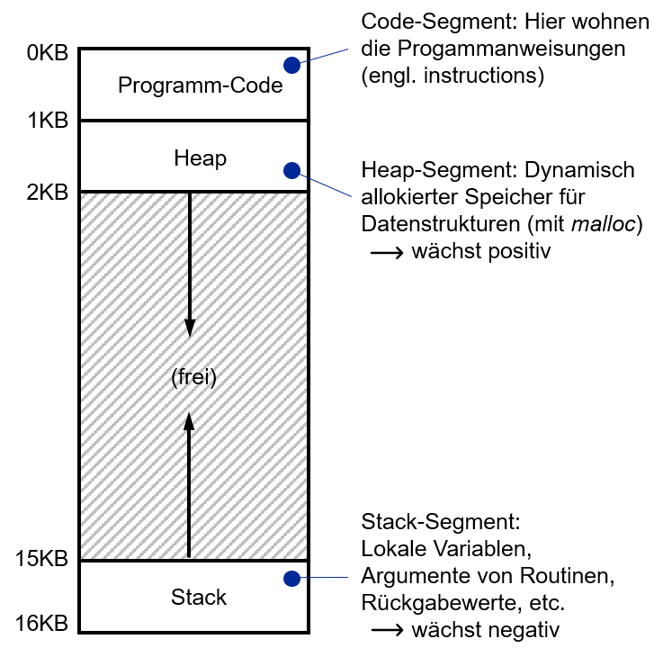
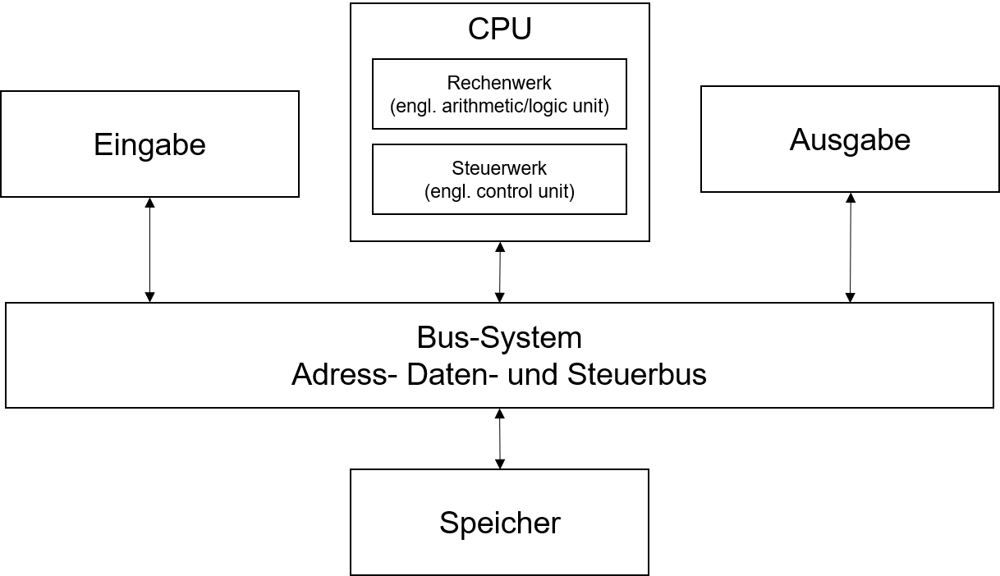
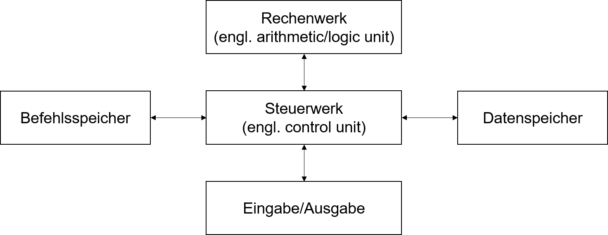

---

marp: true
theme: defalut
paginate: true
footer: 

---

# Exkurs: Von-Neumann vs Harvard 
Prof. Dr.-Ing. Andreas Heil

 Licensed under a Creative Commons Attribution 4.0 International license. Icons by The Noun Project.

v1.0.0

---

# Lernziele und Kompetenzen

---

# Kurze Wiederholung

* Einteilung des Adressraums 
  * Statischer Programm-Code
  * Heap- und Stack

* Konsequenzen
  * Sowohl Speicherzugriffe (Variablen lesen/schreiben) als auch Instruktionen laden, läuft über den gleichen Datenbus

---

# Von-Neumann Architektur

---

# Harvard Architektur

---

# Von-Neumann vs Harvard (1)
## Von-Neumann

* Von-Neumann-Flaschenhalls
* Heute: Durch Caches kein Engpass mehr, da Befehls- und Speicherzugriffe weitestgehend entkoppelt
* Vorteil: Ein Bus macht das Programmieren einfacher, keine Race-Conditions und Daten-Inkohärenz  (deterministisches Programm auch bei Multi-CPU)

---

# Von-Neumann vs Harvard (2)
## Harvard

* Parallelisierung von Befehls- und Datenzugriffen 
In Signalverarbeitung oft genutzt(da möglichst reproduzierbares Verhalten erforderlich)
* Nachteil: Mehrere Adressräume müssen verwaltet werden
* Atmel AVR Prozessor (Arduino)

---

# Referenzen 

---

# Bildnachweise

