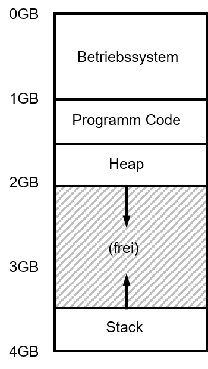
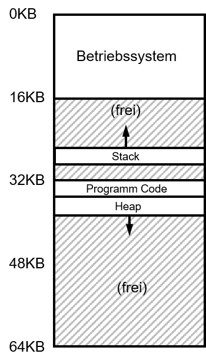
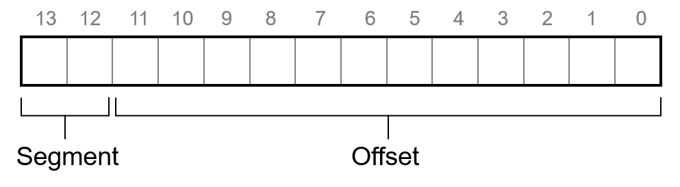
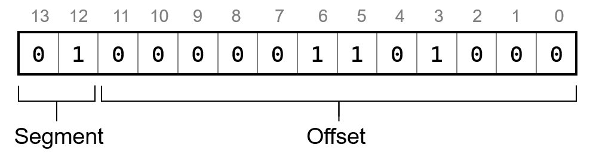

---

marp: true
theme: defalut
paginate: true
footer: 

---
<style>
img[alt~="center"] {
  display: block;
  margin: 0 auto;
}
</style>
# Fortgeschrittene Speichervewaltung
## Segmentierung und Fragmentierung 
Prof. Dr.-Ing. Andreas Heil

 Licensed under a Creative Commons Attribution 4.0 International license. Icons by The Noun Project.

v1.0.0

---

# Lernziele und Kompetenzen

---

# Grundlegende Überlegung

Wie gehen wir mit großen Adressräumen um?

* Zwischen Heap und Stack liegt ggf. viel (ungenützter) Speicher
* Mit 32-Bit lassen sich 4 GB große Adressräume ansprechen



---

# Exkurs 

* Unter 32-Bit Windows waren die obersten 2 GB physikalischem Speicher für Windows Reserviert: max. 2 GB virtueller Adressraum 
* Unter 32-Bit Linux 1 GB physikalischem Speicher für Betriebssystem:  max. 3 GB virtueller Adressraum


---

# Lösung: Segmentierung

* Ein Base- und Bounds-Paar pro logisches Speichersegment des Adressraums
* Was ist eine Speichersegment?
* Zusammenhängender Speicherbereich
* In unserem Fall drei Segmente
  * Programm-Code
  * Heap
  * Stack



---

# Hardware-Unterstützung

* Folglich: Es müssen drei Base- und Bounds-Paare in der MMU unterstützt werden

* Frage: Woher weiß die CPU welches Segment gemeint ist?

* Lösung: Teile der **virtuellen** Speicheradresse werden für das Segment genutzt 

 

---

# Base- und Bounds  Beispiel

| Segment | Base | Größe |
| --- | --- | --- |
|Code|32K|2K|
|Heap|34K|3K|
|Segment|28K|2K|


---

# Segmentation Fault

> Speicherzugriff auf illegale Adresse in segmentiertem (aber auch bei nicht-segmentiertem Speicher)

Wie kann dass passieren?

* Typisch für C-Programmer.
* Aufgrund von Pointer-Arithmetik ist es rechte einfach versehentlich eine Adresse zu »berechnen«, die außerhalb des gültigen Segments liegt

---

# Adressierung von Code-Segmenten (1)

Beispiel:
* 00 - Code Segment
* 01 - Heap Segment 
* 10 - Stack Segment

Berechnung: 
* Offset + Base-Register: physikalische Speicheradresse 
* Zum Prüfen der Obergrenze, wir die Größe hinzuaddiert



---

# Adressierung von Code-Segmenten (2)

* Was ist mit dem Stack?
  * Hardware-Support durch zusätzliches Bit 
* Aus Effizienzgründen: Speicherbereiche können geteilt werden
  * Hardware-Support durch zusätzliches Protection-Bit
  * Segment kann somit in mehreren virtuellen Adressräumen genutzt werden
 
|Segment|Base|Gräße (max. 4K)|Wächst pos.|Schutz|
|---|---|---|---|---|
|Code|32K|2K|1|Read-Execute|
|Heap|34K|3K|1|Read-Write|
|Stack|28K|2K|0|Read-Write|

---

# Segmentierung und das Betriebssystem

* Bei Context Switch müssen Segment-Register ebenfalls gesichert/geladen werden
* Was passiert wenn das Speichersegment nicht genügt? 
  * `malloc`-Aufruf liefert Pointer auf Speicherbereich im Heap, Heap ist jedoch zu klein 
  * `sbrk`-SysCall wird ausgeführt, um Heap zu vergrößern 
  * Betriebssystem vergrößert das Segment und aktualisiert die entsprechenden Register 
  * Hinweis: Vergrößerung kann vom Betriebssystem zurückgewiesen werden (Programm hat bereits genügend Speicher oder es gibt keinen physikalischen Speicher mehr)

---

# Fragmentierung

Speicherfragmentierung (engl. external fragmentation)
* Ursprüngliche Annahme: Alle virtuellen Adressräume sind gleich groß, das ist leider in der Realität nicht so
* Für Segmente müssen passende Speicherbereiche gesucht werden 
* Physikalischer Speicher besteht somit schnell aus einer Vielzahl an belegten Speicherabschnitten und Löchern
* Speicher muss vom Betriebssystem komprimiert werden 

---
# Exkurs: MS-DOS und EMM386.SYS

* Unter MS-DOS gab es Anfangs ein 640KB Limit
* Um den Speicher optimal auszunutzen musste der Speicher händisch optimiert werden, z.B. 
  * durch Nutzung zusätzlicher Tools zur Speicherverwaltung
  * händisches Anordnen der zu ladenden Treiber, um Lücken im 
  * Speicher möglichst zu vermeiden (minimieren)

Hausaufgabe: 
* Lesen Sie [The 640K memory limit of MS-DOS](https://www.xtof.info/blog/?p=985) 


---

# config.sys

```
[common]

SWITCHES=/f#
DOS=NoAutoDOS=high,umb
BUFFERSHIGH=40
FILESHIGH=20
FCBSHIGH=1
LASTDRIVEHIGH=m
DEVICE=c:\drivers\qhmboot.sys
DEVICE=c:\drivers\umbpci.sys /i=e000-efff
DEVICEHIGH=c:\drivers\qhimem.sys /n48
DEVICE=c:\windows\himem.sys
DEVICEHIGH=c:\windows\emm386.exe ram auto
DEVICEHIGH=c:\windows\ifshlp.sys
DEVICEHIGH=c:\drivers\usbaspi.sys /v
DEVICEHIGH=c:\drivers\di1000dd.sys
INSTALL=c:\drivers\ctmouse.exe
DEVICEHIGH=c:\drivers\qcdrom.sys /D:mycdrom
INSTALL=c:\drivers\shcdx33a.com /D:mydrom

``` 

---

# Referenzen 

---

# Bildnachweise

