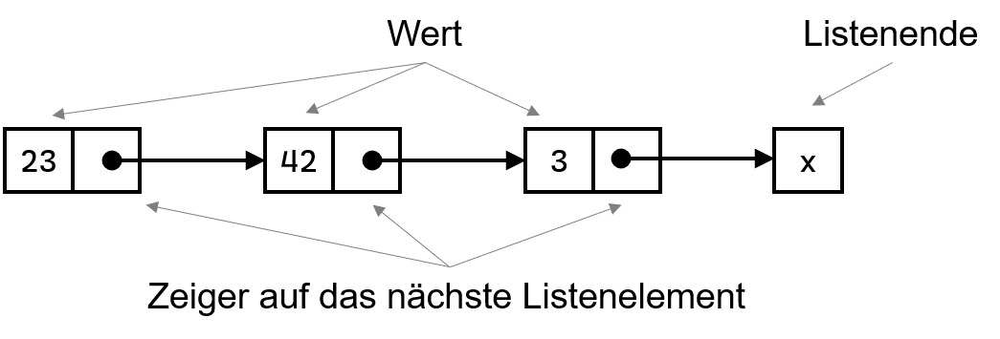
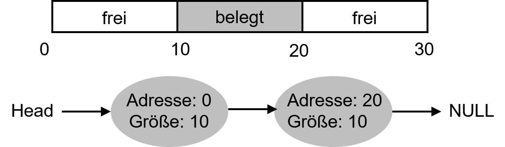
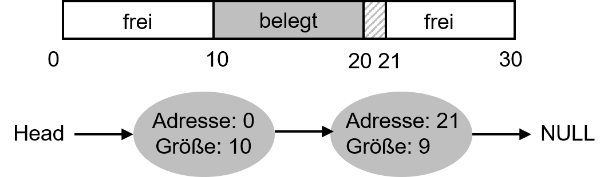
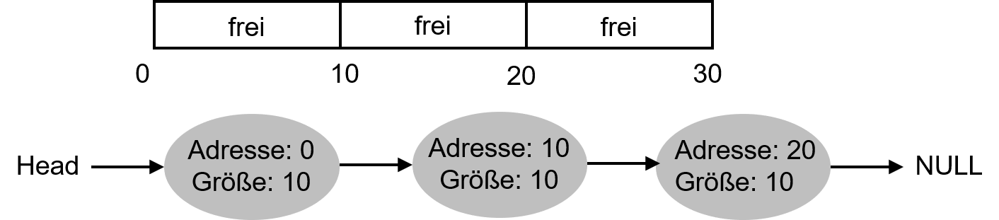

---

marp: true
theme: defalut
paginate: true
footer: 

---

# Fortgeschrittene Speicherverwaltung
## Free-Space Management 
Prof. Dr.-Ing. Andreas Heil

 Licensed under a Creative Commons Attribution 4.0 International license. Icons by The Noun Project.

v1.0.0

---

# Lernziele und Kompetenzen

---

# Wiederholung

* Bisher galt die Annahme, das alle Adressräume gleich sind
* Somit muss man »eigentlich nur« die nächste freie Lücke finden und »auffüllen«
* Segmentierung führt nun jedoch zur Fragmentierung (engl. external fragmentation)
* Innerhalb eines Adressraus spricht man ebenfalls von Fragmentierung (engl. internal fragmentation)

Beispiel: Heap

---

# Free List

* Datenstruktur zur Verwaltung freier Speicherbereiche ist die sog. Free List
* Basiert auf einer verketteten Liste (engl. linked list)

---

# Free List Beispiel (1) 

* Anfragen für größer 10 Bytes schlagen fehl (liefert NULL)
* Exakt 10 Bytes kann durch einen der beiden Blöcke bedient werden 
* Aber was passiert, wenn nur 1 Byte angefordert wird?

---

# Free list Beispiel (2)

* Anfragen für größer 10 Bytes schlagen fehl (liefert NULL)
* Exakt 10 Bytes kann durch einen der beiden Blöcke bedient werden 
* Aber passiert, wenn nur 1 Byte angefordert wird?
* Einer der freien Blöcke wird verkleinert…

---

# Free list Beispiel (3)

* Zurück zur Ausgangssituation mit drei Blöcken…
* Was passiert wenn der mittlere Block freigegeben wird? 
* Es entstehen drei Blöcke… keine Gute Idee…

---

# Free list Beispiel (4)

* Daher fasst die zuständige Bibliothek den freien Speicher vor dem Allokieren so gut wie möglich zusammen

---

# Referenzen 

---

# Bildnachweise

