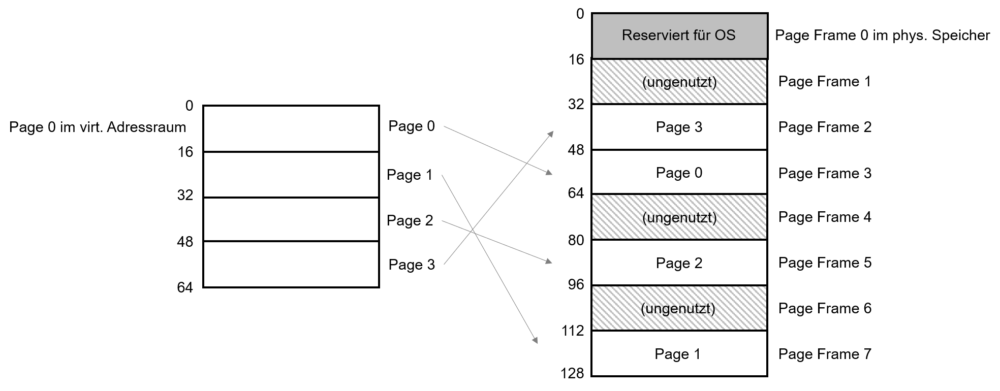
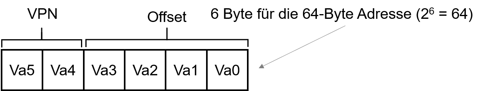
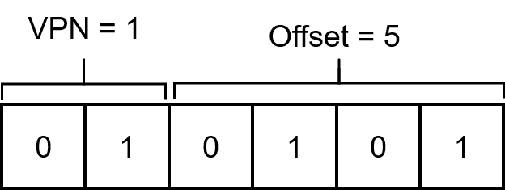

---

marp: true
theme: defalut
paginate: true
footer: 

---
<style>
img[alt~="center"] {
  display: block;
  margin: 0 auto;
}
</style>
# Fortgeschrittene Speicherverwaltung
## Paging 
Prof. Dr.-Ing. Andreas Heil

 Licensed under a Creative Commons Attribution 4.0 International license. Icons by The Noun Project.

v1.0.0

---

# Lernziele und Kompetenzen

---

# Motivation

* Bisher gelernt: Segmentierung führt früher oder später dazu, dass der Speicher fragmentiert…
* Glücklicherweise nutzen Betriebssysteme noch einen zweiten Mechanismus der Speicherverwaltung: Paging
* Dabei wird der Speicher in fixe Einheiten aufgeteilt 
  * Jede solche fixe Einheit heißt Page (dt. Speicherseite)
  * Der physikalische Speicher ist demnach eine Aneinanderreihung von gleichgroßen Slots 
  * Jeder solcher Slot heißt Page Frame (dt. Seitenrahmen)
  * Jeder Frame kann eine Page enthalten 

---

# Beispiel 

Hier ein einfaches Beispiel:
  * 64-Byte virtueller Adressraum
  * 4 Pages a 16-Byte Pages
  * Betriebssystem muss »nur« vier freie Page Frames finden
  * Dafür gibt es eine Free List mit freien Page Frames
  * Datenstruktur mit den Einträgen wo eine Page im physikalischen Speicher liegt, heißt Page Table (dt. Seitentabelle)
  * Es gibt eine Page Table pro Prozess


---

# Zuordnung von Frames 



---

# Paging und Address Translation (1)

* Unser Beispiel zuvor hatte ein 64-Byte Adressraum  
* Nun versuchen wir Daten aus einer virtuellen Adresse `<virtual address>` in das Register `eax` zu laden
* Hierfür benötigen wir zwei Komponenten
  * Virtual Page Number (VPN)
  * Offset (innerhalb der Page)




In Assembler:

```asm
movl <virtual address>, %eax
```

---

# Paging und Address Translation (2)

* Wir haben 16-Byte Seiten in einem 64-Byte Adressraum 
* Es müssen 4 Seiten adressiert werden können 
* Daher die 2-Bit Virtual Page Number (VPN)
* Die restlichen Bits können zur Adressierung innerhalb der Seite verwendet werden (= Offset)

---

# Paging und Address Translation (2)

* Beispiel:
  * Zugriff auf virtuelle Adresse 21
  * 21 im Dezimalsystem in ist 010101 Binär, ist 15 im Hexadezimalsystem
  * Somit Zugriff auf Byte5 in Page 1



In Asssembler: 

```
movl 15h, %eax
```
---

# Paging und Address Translation (3)

* Die physikalische Adresse1 von Page 1 ist 7 (= 111)
* Physical Frame Number (PFN) oder auch Physical Page Number (PPN)


---

# Wo liegen Page Tables?

* Page Tables können sehr groß werden 
  * Pro Eintrag 20-Bit VPN + 12-Bit Offset für 4KB Pages
  * 20-Bit VPN bedeuten 220 Adressberechnungen pro Prozess (ca. 1 Million)  
  * 100 Prozesse in einem 32-Bit System bedeuten ca. 400 MB nur für die Page Tables
  * In 64-Bit Systemen nochmals einiges mehr
* Daher keine extra Hardware (Speicher) in der MMU
* Anstelle dessen werden Sie im Hauptspeicher vorgehalten
  * Konkret im virtuellen Speicher des Betriebssystems vorgehalten

---

# Beispiel: x86 Page-Table-Eintrag

* Present Bit (P): Liegt die Page im Hauptspeicher oder auf Disk (Swapping kommt später)
* Read/Write Bit (R/W): Darf in die Page geschrieben werden
* User/Supervisor Bit (U/S): Kann ein User-Mode Prozess auf die Page zugreifen
* PWT, PCD, PAT u. G: Beschreiben Hardware-Caching 
* Accessed Bit (A): Wird für einen sog. “Least recently used page”-Algorithmus genutzt
* Dirty Bit (D): Wurde der Speicherinhalt verändert 
* PFN: Page Frame Number 


---

# Referenzen 


---

# Bildnachweise

