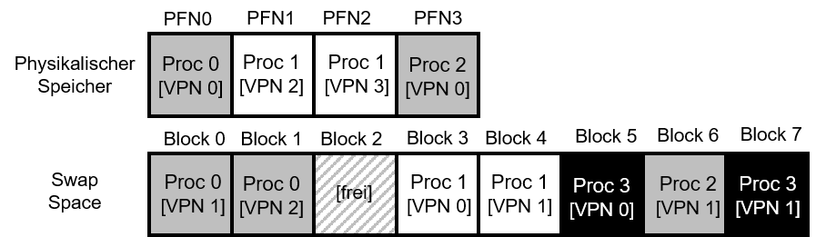

---

marp: true
theme: defalut
paginate: true
footer: 

---

# Swapping

Prof. Dr.-Ing. Andreas Heil

 Licensed under a Creative Commons Attribution 4.0 International license. Icons by The Noun Project.

<!--version-->
v1.0.1
<!--/version-->

---

# Lernziele und Kompetenzen

Hintergründe **verstehen**, weshalb Swapping notwendig ist,

grundlegende Prinzipien für Swapping-Mechanismen **kennen lernen** und

das bisher Gelernte anhand eines Beispiels **widerholen**.

---

# Problem

  * Bisherige Annahme: Der gesamte Adressraum aller laufenden Prozesse befinden sich im Speicher
  * Was\, wenn der Speicher nicht ausreicht bzw\. mehr Speicher benötigt wird als physikalisch vorhanden ist?
  * Lösung: Speicherhierarchie ausbauen\, nicht benötigte Teile der Adressräume in einen anderen Speicher auslagern
  * Typischerweise auf die Festplatte \(HDD\, SSD\)

---

# Swap Space

* Zuerst benötigt:
  * Speicherplatz auf der Festplatte ⏩ Swap Space (dt. Auslagerungsdatei)
  * Mechanismus, um Speicher seitenweise zu speichern und zu laden
  * Swap Space ist maßgeblich für die Anzahl an Pages, die in einem System gleichzeitig verwendet werden können

---

# Wiederholung TLB

* Zur Vereinfachung: System mit Hardware\-basiertem TLB1
  * Programm greift auf virtuelle Speicheradresse zu
  * Die virtuelle Adresse wird auf eine physikalische Adresse gemappt
  * Dafür wird zunächst der TLB auf das Mapping geprüft
  * Falls Mapping im Cache liegt\, steht die physikalische Adresse sehr schnell bereit
  * Wird die VPN nicht gefunden\, wird die Page Table durchsucht\, und der Eintrag für die VPN gesucht
  * Wenn die Seite gültig ist und im physikalischen Speicher liegt\, wird das Mapping in den TLB geladen und die letzte Instruktion _nochmal_ ausgeführt

---

# Present BIT

* Was\, wenn die Page nicht im physikalischen Speicher liegt?
  * Wird durch das __Present__  __Bit__ im Page Table Entry gehandhabt
  * 1: Page ist im physikalischen Speicher \(alles kann wie bisher gehandhabt ablaufen\)
  * 0: Page ist nicht im physikalischen Speicher\, sondern irgendwo auf Platte
  * Jetzt haben wir einen __Page Fault__ \(dt\. Seitenfehler\)
  * Nun muss sich das Betriebssystem darum kümmern und einen sog\. Page Fault Handler ausführen

---

# Page Fault

  * Gleichgültig ob TLB in Hard\- oder Software realisiert ist\, wird der Page Fault Handler durch das Betriebssystem ausgeführt
  * Betriebssystem muss eine Seite von Platte in den Hauptspeicher laden
  * Hierzu kann die Page Table genutzt werden
  * Anstelle der PFN im Page Table Entry\, kann die Adresse der Page auf Platte gespeichert werden \(wir wissen ja aufgrund desPresentBits\, dass die Page auf Platte liegt\!\)
  * Sobald die Page in den Hauptspeicher geladen wurde\, wird die Page Table mit der physikalischen Adresse im Speicher aktualisiert
  * Der nächste Lauf der Instruktion liefert jetzt ein TLB Miss
  * TLB wird wie zuvor aktualisiert und danach die Instruktion zum dritten Mal wiederholt

---

# Speicherprobleme

  * Sobald der Speicher voll ist\, d\.h\. keine Page mehr in den Speicher passt\, müssen Pages ausgelagert \(engl\.pageout\) werden\, bevor eine andere Page geladen werden kann \(engl\.pagein\)\.
  * Welche Seite ausgelagert wird\, regelt die sog\. Page\-ReplacementPolicy
  * __Problem__ : Wird die „falsche“ Seite ausgelagert\, kann dies enorme Performance\-Auswirkungen haben
  * Konkret kann sich Ausführung eines Programmes um den Faktor 10\.000 bis 100\.000 verlangsamen\!\!\!\!1elf

---

# Swapping „in Echt“

  * In Wirklichkeit führt das BetriebssystemSwappingnicht erst aus\, wenn kein Platz mehr im Speicher verfügbar ist
  * HighWatermark \(HW\) und LowWatermark \(LW\)
    * Hintergrundprozess \(sog\.swapdeamon oder pagedeamon\)
    * Weniger Pages als LW verfügbar, d.h. Seiten werden ausgelagert
    * Es werden solange Seite ausgelagert bis HW erreicht wurde
  * Ergänzender Hinweis: Während Seiten nachgeladen werden muss ein Prozess blockiert werden