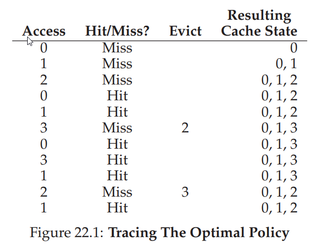
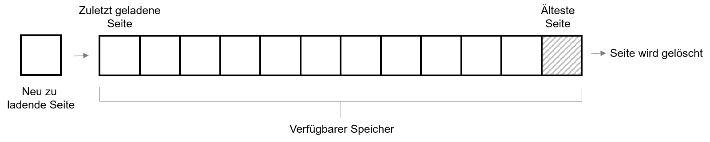
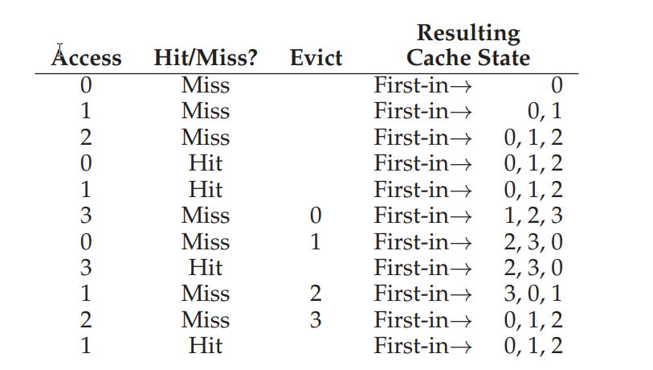
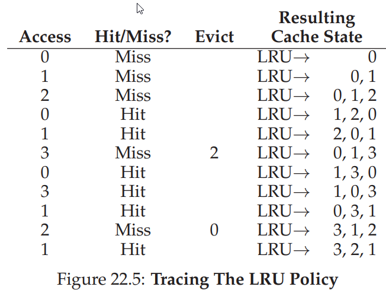
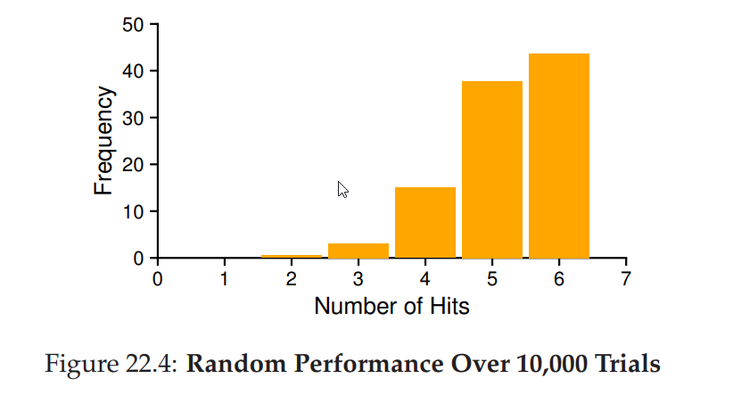

---

marp: true
theme: defalut
paginate: true
footer: 

---

# Swapping Policies

Prof. Dr.-Ing. Andreas Heil

 Licensed under a Creative Commons Attribution 4.0 International license. Icons by The Noun Project.

v1.0.0

---

# Policies - Motivation

  * Solange es genügend Speicher gibt\, ist Speichermanagement kein Problem
  * Sobald es „eng wird“ \(engl\.memorypressure\) sieht die Sache ganz anders aus
  * Welche Seiten ausgelagert werden\, wird durch einen Cache\-Algorithmus \(engl\.replacementpolicy\) geregelt
  * Im Folgenden werden wir uns daher der Fragestellung widmen\, wie entschieden werden kann\, welche Seiten am „geschicktesten“ ausgelagert werden können\.

---

# Cache Management

* Grundsätzliche Idee:
  * Wenn der Hauptspeicher „nur“ einen Teil aller Pages enthält\, kann man ihn als __Cache__ für virtuelle Speicherseiten verstehen
* Grundsätzliches Ziel eines jeden Caches: __Cache__  __Misses__ reduzieren
  * D\.h\. bei uns die Häufigkeit zu minimieren\, dass eine Seite von Platte gelesen werden muss oder
  * Die Anzahl der Cache Hits zu maximieren\, d\.h\. wenn eine auf eine Seitenzugegriffen wird\, dass sich diese im Hauptspeicher befindet

---

# Durchschnittliche Zugriffszeit

* Sind die Zugriffszeiten auf Speicher und Platte bekannt lässt sich die sog\. Average Memory Access Time \(Abk\. AMAT\) berechnen:
  * Zugriffszeit auf Hauptspeicher
  * Wahrscheinlichkeit eine Seite nicht im Cache zu finden \[0\,0\.\.1\,0\]
  * Zugriffszeit auf Platte/Disk

---

# Optimal Replacement policy

Bildquelle: OSTEP

---

# Policy: FIFO

* First in First out \(FIFO\) sollte noch aus Scheduling bekannt sein
  * Einfachste der Ersetzungsstrategien
  * Jede Seite\, die geladen wird\, liegt in einer Queue
  * Ist kein Platz mehr vorhanden\, wird die Seite ersetzt\, die am längsten in der Queue ist

<!--
Zuletzt geladeneSeite

Seite wird gelöscht

Neu zuladende Seite

Verfügbarer Speicher
-->
---

# FIFO: Beispiel

  * Verglichen mit dem optimalen Algorithmus schlecht
  * 36\,4% bzw\. 57\,1% \(ohne ersten Miss\) Hit Rate
  * Problem: FIFO hat keine Kenntnis über Relevanz einer Seite
  * Hier: Obwohl Seite 0 oft genutzt wird\, wird Sie durch FIFO irgendwann rausgeworfen\, nur weil es die erste Seite war\, die geladen war

---

# FIFO: Beispiel

Bildquelle: OSTEP

---

# Policy: Random

* Zufallsstrategie \(engl\.random\)
  * Zu ersetzende Seiten werden zufällig ausgewählt
  * Hit Rates sind Glücksache
  * Im vorliegenden Beispiel besser als FIFO\, schlechter als der optimale Algorithmus
  * Hier: in 40 % von 10\.000 Testläufen war Random so gut wie der Optimale Alg\.
  * Kann aber auch wesentlich schlechter sein

---

# Policy: Random

Bildquelle: OSTEP

---

# Policy: Random

Bildquelle: OSTEP

---

# Policy: LRU

* LastRecentlyUsed\(Abk\. LRU\)
  * Ähnliche wie im Scheduling\, aus der  nahen Vergangenheit lernen\, um die Vorhersage für die Zukunft zu verbessern
  * Grundidee: Wenn ein Programm auf eine Seite in der nahen Vergangenheit zugegriffen hat\, greift s vermutlich nochmals in der nahen Zukunft auf die Seite zu
  * Historische Informationen
  * Nutzungsfrequenz \(engl\.frequency\)  häufig benutzte Seiten sollten nicht ersetzt werden
  * Neuheit \(engl\.recency\) vor kurzem genutzte Seiten sollten nichtersetzt werden

---

# Lokalitätsprinzip

* Lokalitätsprinzip \(engl\.principle of locality\)
  * Empirische Beobachtung von Programmen
  * Programme tendieren dazu\, auf Code\-Sequenzen und Datenstrukturen zuzugreifen\, die nahe beieinander liegen \(Schleifen\, Arrays etc\.\)
  * Diese Pages sollten demnach möglichst im Speicher gehalten werden
  * Hieraus sind die historisch\-basierten Algorithmen entstanden…

---

# {M|L}{F|R}U

  * Gut geeignet und einfach zu merken:
  * Least\-Frequently\-Used\(LFU\)
    * Ersetzt die am seltensten genutzte Seite
  * Least\-Recently\-Used\(LRU\)
    * Ersetzt die wenigstens aktuell genutzte Seite
  * Eher schlecht\, da das Lokalitätsprinzip nicht beachtet wird:
  * Most\-Frequent\-Used\(MFU\)
  * Most\-Recently\-Used\(MRU\)

---

# Implementierung von historisch basierten Algorithmen

  * LRU
  * Bei jedem Seitenzugriff muss \(Instruktionen oder Daten\) muss die Seite an die Spitze der „Liste“ \(welche Datenstruktur wäre hier geeignet?\) verschoben werden
  * Konkret: Bei jedem Speicherzugriff müsste diese Datenstruktur aktualisiert werden
  * Mögliche Lösung: Hardware\-Support
  * Was wir wissen\, bei 4GB Speicher mit 4KB Seiten ca\. 1 Mio\. Pages
  * Zugriff auf eine solche Datenstruktur \(1 Mio\. Einträge\) dauert dann doch etwas\, selbst bei heutigen Rechnergeschwindigkeiten

---

# Annäherung an LRU

* Wir haben die Lösung bereits kennen gelernt: __Use Bit__
  * Bei jedem Zugriff \(lesen/schreiben\) auf eine Page wird das Use Bit  aktualisiert
    * Dafür ist die Hardware zuständig
    * Bit kann in der \(pro Prozess\) Page Table liegen oder in einen gesonderten Array
    * Bit wird dabei auf 1 gesetzt
    * Hardware löscht dieses Bit nie\, dafür ist das Betriebssystem zuständig
* Wie kann das Use Bit sinnvoll gelöscht werden?

---

# Clock Algorithmus

  * Alle Pages sind als Kreis \(wie eine Uhr\) angeordnet
  * Uhrzeiger zeigt auf eine Seite
  * Wenn eine Ersetzung stattfindet\, wird geprüft ob das aktuelle Use Bit auf 0 oder 1 steht
    * Wurde Seite P vor Kurzem genutzt \(Use Bit = 1\)\, ist sie kein guter Kandidat zum Ersetzen
    * Use Bit wird nun auf 0 gesetzt und Zeiger geht zum nächsten Eintrag P \+ 1
    * Algorithmus fährt solange fort\, bis ein Eintrag mit 0 gefunden wird
* Alternativen?
  * Alle Use Bits periodisch löschen wäre auch möglich

---

# Dirty Bit

* Erweiterung des ClockAlgorithm
  * Verwendung eines sog\. »DirtyBit« \(manchmal auchModifiedBit\)
  * Wird gesetzt\, wenn auf die Seite im Speicher zugegriffen wurde
  * Wurde eine Seite im Speicher verändert\, muss Sie noch zurück auf Platte geschrieben werden \(= teuer\)

  * Wurde die Seite noch nicht modifiziert \(z\.B\. nur Leseoperationen\) oder wurde si schon zurück geschrieben\, wird dasDirtyBit auf 0 gesetzt
  * Seite kann dann ohne weitere Maßnahmen ersetzt werden

---

# Zusätzliche Policies

  * Für die meisten Seiten wird » DemandPaging«\, also nachladen bei Bedarf eingesetzt
  * »Prefetching« kann in besonderen Fällen genutzt werden\, d\.h\. eine Seite kann schon vorher geladen werden \(dafür muss es jedoch sehr gute Gründe\) geben
  * Wegschreiben von Seiten kann aus Effizienzgründen auch gemeinsam stattfinden\, bekannt als »Clustering« oder auch »Grouping«

---

# Thrashing

* Problemstellung: Was sollte das Betriebssystem unternehmen\, wenn das System hoffnungslos überbucht ist?
  * Annahme: Der gesamte Speicherbedarf der laufenden Prozesse überschreitet permanent den physikalisch verfügbaren Speicher
  * Konsequenz: Das System muss permanent auslagern\.
  * Lösungsansätze \[1\]
  * Linux: Killt die/den speicherintensivsten Prozess
  * OpenSolaris: Drei Status\, normal\, soft \(ganze Prozesse werden ausgelgert\) und hard\(schlafende Prozesse werden ausgelagert\, unbenutzte Module werden entladen\)
  * Windows XP: Lang schlafende Prozesse werden ausgelagert\, es würde überwacht\, welche Prozsse anderen Prozessen Pages „stehlen“

