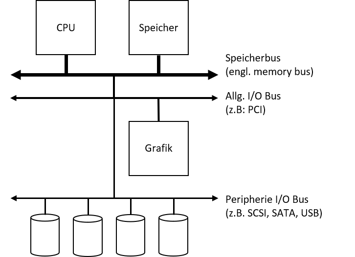
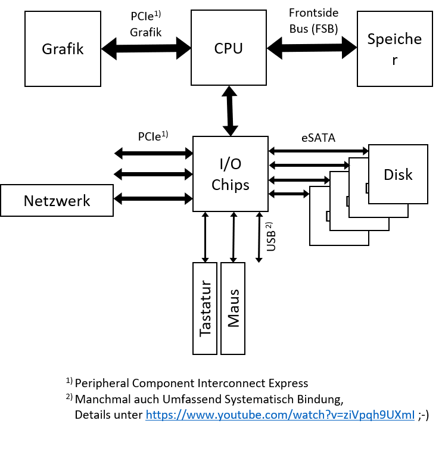
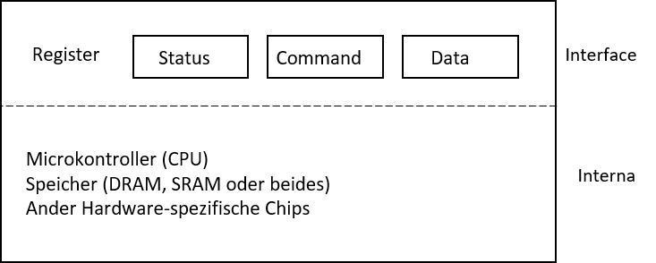
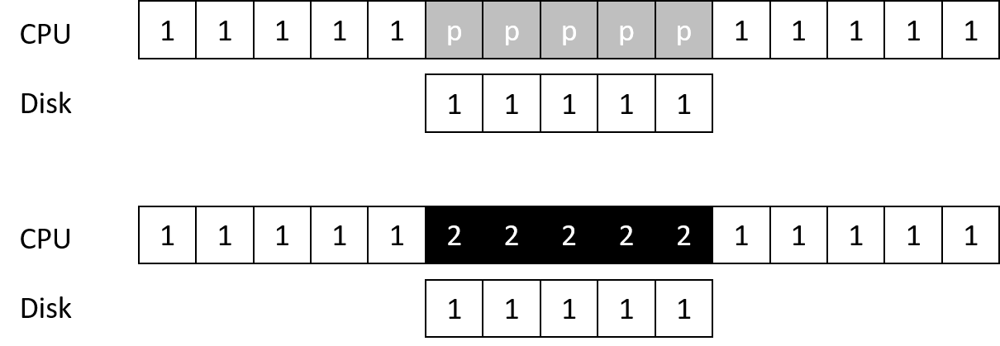
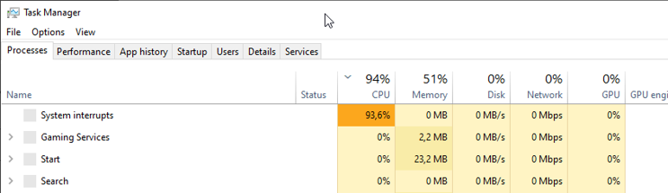
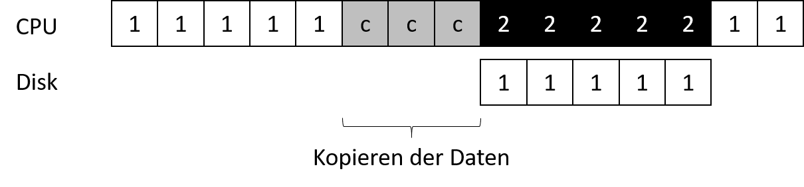
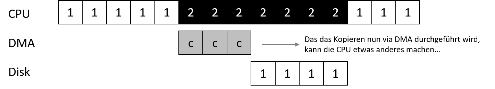
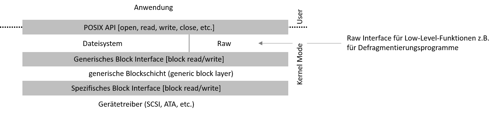

---

marp: true
theme: defalut
paginate: true
footer: 

---
<style>
img[alt~="center"] {
  display: block;
  margin: 0 auto;
}
</style>
# Betriebssysteme
## I/O - Teil 1: I/O Devices

Prof. Dr.-Ing. Andreas Heil

 Licensed under a Creative Commons Attribution 4.0 International license. Icons by The Noun Project.

<!--version-->
v1.0.0
<!--/version-->

---

# Lernziele und Kompetenzen

**Verstehen** wie I/O Devices grundsätzlich aufgebaut sind und wie sich diese in das Betriebssystem integrieren

--- 


# Motivation

* Gedankenspiel:
  * Was wäre ein Programm ohne Eingabe? Es lieferte immer die gleiche Antwort\.
  * Was wäre ein Programm ohne Ausgabe?  🤔
* Ein\-/Ausgabe stellt somit einen zentralen Aspekt von Rechnern dar.
  * Wie lässt sich Ein\-/Ausgabe in ein System integrieren?
  * Was sind die grundlegenden Mechanismen?
  * Wie können diese effizient umgesetzt werden?

---

# Ein-/Ausgabe Geräte

Geräte zur Eingabe/Ausgaben \(engl\.input/output devices, kurz I/O devices\)  hängen stark von der Systemarchitektur ab.

* Wie sollte I/O grundsätzlich in das System integriert werden?
* Was sind die grundlegenden Mechanismen?
* Wie können I/O-Operationen effizient gehandhabt werden?



---

# 1,2,3 BUS

* Wir unterscheiden zwischen
  * Speicher\-Bus zur schnellen Anbindung des Hauptspeichers
  * Einem allgemeinen I/O\-Bus zur systeminternen Kommunikation \(bei modernen Geräten ist dies PCI\)
  * Peripherie\-Bus \(SCSI\, SATA oder USB\)
* Warum aber mehrere Bus\-Systeme?
  * Physik und Kosten sind hier die maßgeblichen Größen
  * Je schneller der Bus\, desto kürzer
  * Je schneller der Bus\, desto teurer

---

# I/O Chips

* Moderne Architekturen nutzen daher spezielle I/O Chips zum schnellen Routen von Daten
* Beispiel für einen solchen Chip ist Intel DMI \(Direct Media Interface\)
* Anbindung von Festplatten via eSATA \(external SATA\) als Weiterentwicklung von SATA \(Serial ATA\) als Weiterentwicklung von ATA bzw. IBM AT Attachment (2. IBM PC Generation mit 6 MHz Intel 80286 CPUs))
* USB – Universal Serial Bus für sog\. Low Performance Devices

---

# Einsatz von I/O Chips



---

# Canonical Device

* Grundlegendes \(allgemeingültiges\) Konzept eines Gerätes
  * Besteht aus zwei wichtigen Komponenten:
  * Hardware Interface, über den das das Gerät angesteuert werden kann
  * Interne Strukturen
    * Implementierungsabhängig
    * Ein paar Chips\, komplexere Geräte sogar mit einer CPU
    * Allgemeiner Speicher und weitere Chips



---

# Canonical Protocol

* Allgemeingültiges Protokoll zur Ansteuerung von I/O-Geräten
* Im Beispiel zuvor: 3 Register
  * Status Register: Ermöglicht es\, den Status des Geräts auszulesen
  * Command Register: Ermöglicht es\, dem Gerät mitzuteilen\, welche Aktion als nächstes ausgeführt werden soll
  * Data Register: Ermöglicht es Daten ins Gerät zu übermitteln
  * Durch Schreiben/Lesen dieser Register wird die Interkation mit dem Gerät ermöglicht

---

# Das Protokoll in 4 Schritten

1. Warten bis das Gerät bereit ist
2. Daten in Register schreiben
3. Kommando in Register schreiben
4. Warten bis Gerät fertig ist

```
while \(STATUS == BUSY\)
; // wait until device is not busy
write data to DATA register
write command to COMMAND register
(starts the device and executes the command\)
while \(STATUS == BUSY\) ;
// wait until device is done with your request
```

---

# Polling

  * Das Status Register fortwährend auszulesen wird auch __Polling__ genannt
  * Im Grund wird andauernd gefragt: „Ey Digga\, was geht?\!“
  * Abhängig von der Größe des Daten Registers sind hier mehrere Durchläufe erforderlich\, bis alle Daten geschrieben sind

---

# PIO

  * Sobald die CPU \(hier meinen wir die CPU vom Rechner\, nicht vom I/O Gerät\) für das "Hin\- und Herschippern" der Daten genutzt wird, sprechen wir von __programmed__  __I/O \(Abk\. PIO\)__
  * Das Protokoll funktioniert im Grunde ABER
  * Polling ist kostenintensiv
    * Verschwendet CPU Cycles
    * Verlangsamt oder blockiert die Ausführung anderer Prozesse
    * Führt die Idee des Overlapping beim Scheduling ad absurdum

---

# Interrupts

* Idee: Den CPU Overhead mittels Interrupts reduzieren
* Grundsätzliche Funktionsweise
  * Betriebssystem stellt eine Anfrage an ein Gerät
  * Der aufrufende Prozess wird schlafen geschickt
  * Betriebssystem führt einen Kontext\-Switch zu einem anderen Prozess aus
  * Sobald das Gerät fertig ist\, wird ein Hardware Interrupt ausgelöst
  * Der Interrupt veranlasst das Betriebssystem eine vordefinierten __Interrupt Service Routine__ \(ISR\) bzw. __Interrupt Handler__ auszuführen\.

---

# Polling vs Interrupts

In dem erste Beispiel pollt die CPU\, bis das Gerät fertig ist.

Mit einem Interrupt könnte die CPU in der Zwischenzeit etwas anders \(sinnvolles\) machen.



---

# Performance

* Interrupts sind nicht immer die beste Lösung
  * Wenn das Gerät so schnell ist\, dass beim ersten Poll die Antwort käme\, machen Interrupts das System langsamer
  * Der damit zusammenhängenden context Switch ist im Verhältnis zum „kurz Warten“ teurer

---

# Livelocks

Zu viele Interrupts können das System auch überlasten

In diesem Fall sprechen wir von einem __Livelock__




---

# Lösung: Hybrid Ansatz

Die Lösung zum\, vorherigen Problem: Zwei Phasen

* Für einen kurzen Zeitraum pollen
* Wenn das Gerät nicht geantwortet hat einen Interrupt nutzen

Ein konkretes Beispiel:Ein Web\-Server erhält plötzlich \(extrem\) viele Anfragen\. Wenn nun bei eintreffenden Paketen nur noch Interrupts ausgelöst werden\, läuft im Prinzip kein Prozess mehr im User\-Space\.Daher wäre es besser den Web\-Server selbst entscheiden zu lassen wann er neue Pakete entgegen nimmt\.

---

# Alternativer Lösungsansatz: Coalesing

* Wenn ein Gerät fertig ist\, wird der Interrupt nicht sofort ausgelöst\!
  * Anstelle dessen wartet das Gerät einen Moment ob bzw. bis weiter Anfragen abgearbeitet sind
  * Nun werden alle bearbeitet Requests gebündelt zurück geliefert, in dem der Interrupt nur einmal ausgelöst wird
* Nachteil
  * Zu langes Warten kann zu einer erhöhten Latenz des Gerätes führen

---

# Datenschubsen

Nicht nur das Polling auch bei anderen Aufgaben wird die CPU für eigentlich triviale Aufgaben in Anspruch genommen: z.B. das Kopieren von Daten in die Daten Register

Frage: Wie kann der CPU Arbeit abgenommen werden\, damit die CPU effizienter genutzt werden kann? Ganz einfach: Kopieren der Daten



---

# DMA: Direct Memory Access

* Eine separate DMA Engine orchestriert den Datenfluss zwischen Gerät und Hauptspeicher
  * Funktionsweise: Das Betriebssystem programmiert die DMA Engine mit
    * Speicherort an dem die Daten liegen
    * Wie viele Daten kopiert werden sollen
    * An welches Gerät die Daten geschickt werden sollen und ist jetzt quasi fertig!



---

# Kommunikation mit dem Gerät

Nun stellt sich noch die Frage\, wie die ganzen Geräte mit ihren spezifischen Hardware Interfaces in das Betriebssystem passen\.

Ziel: Betriebssystem so gut wie es geht Geräte\-neutral halten\, also die Details der Geräteinteraktion vom Betriebssystem „verstecken“\.

Lösung: Wie so oft in der Informatik hilft uns hier die __Abstraktion__ \!



---

# Gerätetreiber

Die gerätespezifische Funktionalität wird als Gerätetreiber ausgeliefert\.

Nachteil: Durch die generische Schnittstelle können nicht immer alle \(tollen\) Funktionen eines Geräts genutzt werden\.

Beispiel: SCSI Error\-Funktionalität ist unter Linux über die einfachere ATA/DIE Schnittstelle nicht nutzbar\.

Bedeutung von Gerätetreibern:Bis zu 70% des Codes eines Betriebssystems \(Linux und Windows annähernd gleich viel\) steckt heute inzwischen in Gerätetreibern\.

__Problem__ : Dieser Code wird nicht von Kernel\-Entwicklern gebaut\.

---

# Referenzen