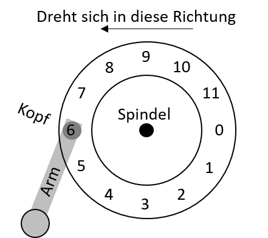
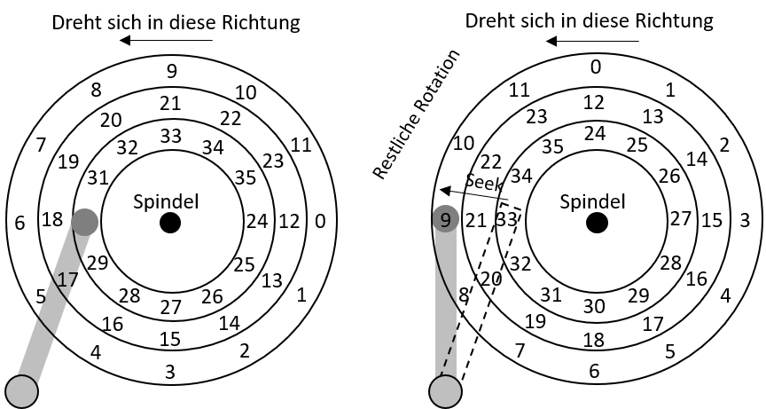

---

marp: true
theme: defalut
paginate: true
footer: 

---

# Betriebssysteme
## I/O - Teil 2: Hard Disk Drives

Prof. Dr.-Ing. Andreas Heil

 Licensed under a Creative Commons Attribution 4.0 International license. Icons by The Noun Project.

<!--version-->
v1.0.2
<!--/version-->

---

# Lernziele und Kompetenzen

Den Aufbau von Hard Disk Drives und RAID\-Systemen **kennen lernen** und die Prinzipien bei der Ansteuerung durch das Betriebssystem **verstehen**.

---

# Datenpersistenz

* Hard Disk Drives \(dt\. Festplatten\) sind die seit Jahrzehnten am weit verbreitetsten Art Daten zu speichern\.
* Dateisysteme hängen dabei stark von den darunterliegenden Geräten ab
  * Wie speichern moderne Hard Disks überhaupt Daten ab?
  * Wie sieht das Interface hierfür aus?
  * Wie sind die Daten konkret angeordnet und wie wird darauf zugegriffen?
  * Wie lässt sich mit „Disk Scheduling“ die Leistung verbessern?
  * Welche Konsequenz hat der Wandel von klassischen Festplatten hin zu Solid State Disks (Abk. SSD)?

---

# Das Interface

Der Aufbau ist im Grundprinzip immer ähnlich

* Das Laufwerk besteht aus einer Anzahl von Sektoren
  (i.d.R. in Form von 512-Byte Blöcken)
* Jeder Block kann individuell gelesen und geschrieben werden
* Alle Sektoren sind nummeriert 0 bis $n−1$ (bei $n$ Sektoren) 
* Multi-Sektor-Operationen sing möglich (und gängig)
* Viele Dateisysteme lesen 4KB oder mehr auf einmal 
* Atomare Schreiboperationen sind nur auf 512-Byte Blöcke zugesichert 

---

# Torn Write

Nur die ersten drei Blöcke wurden geschrieben\, obwohl der Stromausfall erst sehr spät  bei der Schreiboperation von Block 4 aufgetreten ist

---

# Inoffizielle Annahmen

* Annahmen\, die von vielen Clients getroffen werden \(unwritten contract\):
  * Auf zwei nahe beieinander liegende Blöcke kann schneller zugegriffen werden\, als auf weit entfernt liegende
  * Der Zugriff auf fortlaufende Böcke \(engl\. sequential read/write\) ist der schnellste Zugriff überhaupt und gewöhnlich  schneller als der wahlfreie Zugriff \(engl\. randomaccess\)

  Angenommen\, Sie schreiben einen Treiber für \(konventionelle\) Festplatten unter diesen  Annahmen und morgen tauscht jemand die Festplatten gegen Solid State Disks aus…

---

# Grundlegende Geometrie

  * Eine oder mehrere Scheiben (engl. platter), jede mit je zwei Seiten
  * Magnetische Oberfläche aus Eisenoxid - oder Kobalt\-Deckschicht \(engl\. surface\)
  * Achse bzw\. Spindle \(engl\. spindle\)
  * Schreib\-Lese\-Kopf \(engl\. disk\-head\)
  * Arm mittels dem der Schreib\-Lese\-Kopf positioniert wird \(engl\.diskarm\)
  * Daten sind in konzentrischen Kreisen \(engl\.tracks\) angeordnet
  * Umdrehung wird in RPM \(rotationsperminute\) gemessen\.
  * Typische Werte heutzutage von 7\.200 bis 15\.000 RPM
  * Interessant wird die Umdrehungszeit\, bei 10\.000 RPM sind dies ca\. 6ms

---

# Eine einfache Festplatte

* Einige (vereinfachende) Annahmen
  * Ein Track
  * Track besteht aus 12 Sektoren bzw. Blöcken (Sektoren)
  * Jeder Block besteht aus 512 Byte
  * Die Scheibe dreht sich gegen der Uhrzeiger Sinn

---

# Rotational Delay

* Rotational Delay oder auch Rotational Latency – Zeit bis sich der gesuchte Sektor unter dem Schreib-Lese-Kopf befindet 
* Eine vollständige Umdrehung dauert $R$ 
* Suchen wir Sektor 0 und starten bei Sektor 6, ist das Delay $R/2$
* Der Worst-Case wäre im Beispiel zuvor ein Start bei 5, hier wird fast eine ganze Rotation benötigt und das Delay beträgt somit fast $R$

---

# Seek Time (1)

* In Wirklichkeit besitzen HDDs **sehr viele** Tracks und der Schreib\-Lese\-Kopf muss permanent ausgerichtet werden
  * Hier: Kopf über dem innersten Track muss zum äußersten bewegt werden \(engl\.seek\):
  * Rotation undSeeksind mit die teuersten Operationen einer Festplatte
  * Seeking besteht aus vier Phasen:
    * Beschleunigung \(engl\.accelaration\)
    * Schub bei voller Geschwindigkeit \(engl\.coasting\)
    * Abbremsung \(engl\.deceleration\)
    * Einschwingzeit \(engl\.settlingtime\) mit 0\,5 bis 2ms

---

# Seek Time (2)

---

# Transfer und andere unwichtige Dinge

Erst wenn der Kopf korrekt positioniert ist \(stellen Sie sich vor\, er wäre nur ungefähr auf dem richtigen Track🤦‍♂️\) findet der Transfer \(engl\.transfer\) statt\.

Um dass sequentielle Lesen zu ermöglichen, nutzen manche Disks ein sog\. Spurversatz \(engl\. trackskew\) an\, damit keine Latenz nach dem Neupositionieren entsteht\, wenn die Daten auf einem anderen Sektor weitergeführt werden\.

Außen befinden sich mehr Sektoren \(Physik rulez\!\)\, daher werden Platten oft in Zonen \(engl\. multi\-zoned disks\)\. Äußere Zonen besitzen dann mehr Sektoren als innere\.

Schreib\-/Lesecache zur Performance\-Steigerung\. Beim Schreiben kann sofort nach dem Cachen bestätigt werden \(engl\.writeback\) oder erst nach dem Schreiben auf Platte \(engl\.writethrough\).

---

# I/O Zeiten

Wie setzt sich nun die Zeit für einen I/O-Zugriff zusammen?

$$T_{I/O}=T_{seek} +T_{rotation}+T_{transfer}$$

Für den Plattenvergleich gerne genutzt: I/O Rate:

$$ R_{I/O} = {\frac{Size_{transfer}}{T_{I/O}}} $$

---

# Disk Scheduling

* Aufgrund der hohen Kosten für Disk Zugriffe entscheidet der Disk Scheduler über die Zugriffe:
  * Anders als bei Prozessen kann man bei Plattenzugriffen die Dauer gut berechnen
  * Auf Basis von Seek-Zeiten und der Rotation Delay kann der kürzeste Job gefunden werden

---

# Scheduling-Strategien – SSTF

  __SSTF:__  __Shortest__  __Seek__  __Time First__
  * Anordnung der Jobs nach Track – die Anfrage mit dem am nächst gelegenen Track wird zuerst gewählt
  * Problem: Die Disk Geometrie ist dem Betriebssystem nicht bekannt
  * Anstelle dessen kann der nächst gelegen Block verwendet werden \(nearest\-block\-first\, Abk\. NBF\)
  * Problem 2:Starvation– Bei einem fortlaufenden Strom von Anfragen auf z\.B\. die inneren Tracks würden Anfragen auf die äußeren ignoriert
  * Wie kann dieses Problem gelöst werden?

---

# Scheduling-Strategien – SCAN/C-SCAN

  **SCAN**
  * Anfragen werden von den äußeren zu den inneren Tracks und wieder zurück etc\. abgearbeitet \(engl\.sweep\)

**C\-SCAN \(CircularSCAN\)**
  * Anstelle in beiden Richtungen werden Anfragen immer von den äußeren Tracks abgearbeitet
  * Fairer gegenüber den äußeren und inneren Tracks\, da reines SCAN zweimal die mittleren Tracks trifft
  * Allerdings werden SCAN/C\-SCAN nicht annähernd einem SJF\-Ansatz gerecht

---

# Scheduling Strategien – SPTF

**SPTF:Shortest Positioning Time First (auch SATF: Shortest Access Time First\)**

  * Ausgangspunkt s\. Abbildung
  * Sollte nun Track 8 oder 16 zuerst gewählt werden?
  * Abhängig von Seek\-Zeit und Rotation\-Delay
  * Löst eigentlich unsere vorherigen Probleme
  * Problem: Das Betriebssystem kennt meist nicht die Track\-Grenzen nicht und weiß nicht wo sich der Schreib\-Lese\-Kopf gerade befindet
  * Daher wird SPFT meist innerhalb des Drives selbst implementiert

Dreht sich in diese Richtung

---

# Weiter Herausforderungen

  * Früher wurde das gesamte Scheduling im Betriebssystem realisiert – früher waren die Disks „einfacher“ gebaut\.
  * Heute besitzen Festplatten einen komplexen Scheduler auf dem Disk Controller\, der exakte Daten über die internen Positionen hat\.
  * Das Betriebssystem schickt die Requests an die Disk\, die es am geeignetsten hält und die Disk kümmert sich um den Rest\.
  * I/O Merging:Requests\, die nahe aneinander liegende Sektoren betreffen\, sollten möglichst zusammengefasst werden\, da dies den Overhead für das Betriebssystem reduziert\.
  * Wie lange soll der Scheduler warten\, bis eine I/O\-Anfrage abgearbeitet wird? Es könnte ja noch eine „bessere“ Anfrage kommen\, so dass die Disk effizienter genutzt werden kann\.

---

Referenzen