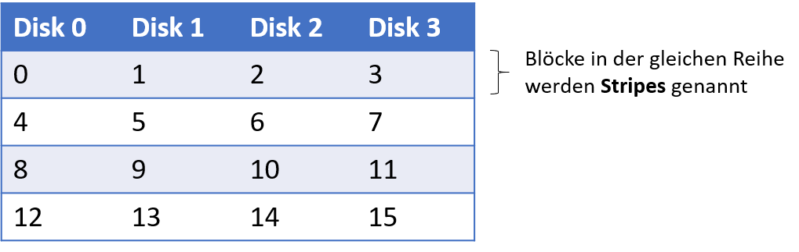
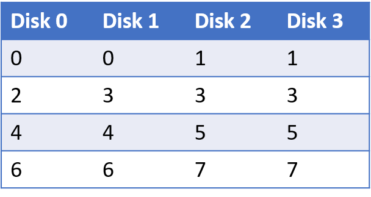
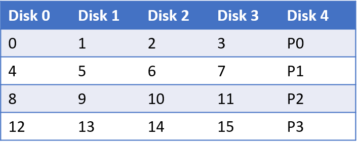
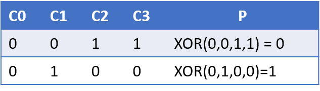
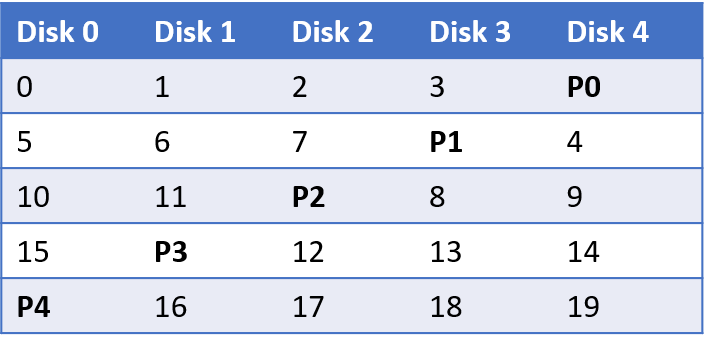

---

marp: true
theme: defalut
paginate: true
footer: 

---

# Betriebssysteme
## I/O - Teil 3: RAID Systeme

Prof. Dr.-Ing. Andreas Heil

 Licensed under a Creative Commons Attribution 4.0 International license. Icons by The Noun Project.

<!--version-->
v1.0.0
<!--/version-->

---

# Lernziele und Kompetenzen

Den Aufbau von RAID-Systemen **kennen lernen** und die Prinzipien bei der Ansteuerung durch das Betriebssystem **verstehen**.

---

# RAID – Einführung

Festplatten gehören zu den **langsamsten** Komponenten in einem Rechner. Wenn eine Festplatte ausfällt, sind die persistierten Daten verloren. Außer Sie haben ein Backup, aber das ist hier nicht der Punkt, wicht hier ist jedoch: RAID ist kein Backup!

Zunächst die Frage: Wie kann ein großes, schnelles und zuverlässiges Speichersystem geschaffen werden?

* Von außen betrachtet sieht ein RAID wie _eine_ Festplatte aus. 
* Intern ist ein RAID jedoch ein höchst komplexes System mit zahlreichen Vorteilen: 
  * Performance, Speicherplatz (Kapazität) und Zuverlässigkeit
  * RAID Systeme verkraften außerdem den Ausfall einzelner Festplatten

---

# Interface

Für das Dateisystem sieht ein RAID System aus wie eine einzelne Festplatte (warum es das nicht ist klären wir später).

* Bei einem Request durch das Betriebssystem\, muss das RAID ermitteln auf welche Disk \(bzw\. abhängig vom RAID Level\, auf welche Disks\) zugegriffen werden muss\.

* Da die Daten auf mehrere Disks verteilt sind\, müssen mehrere physikalische I/O\-Zugriffe pro logischen I/O\-Zugriff stattfinden\.

---

# RAID Charakteristika - Kapazität

Auf Basis welcher Kriterien können RAID-Systeme evaluiert werden?

**Kapazität**

* Wie viel effektiver Speicherplatz ist verfügbar, wenn $N$ Disks mit $B$ Blöcken verwendet werden? 
Ohne Redundanz sind dies $𝑁\cdot𝐵$
* Wenn zwei Kopien vorgehalten werden (engl. mirroring) wären dies $(𝑁\cdot𝐵)∕2$
* Verschiedene RAID-Level liegen irgendwo dazwischen 

---

# RAID Charakteristika - Zuverlässigkeit

* Zur Vereinfachung gehen wir derzeit von einem einzigen Fehlermodell aus: Eine Disk fällt komplett aus\, einem sog\. Fail\-Stop\.
* Des weiteren gehen wir davon aus\, dass der RAID\-Controller dies auch direkt feststellen kann.
  * Wie viele Disks können ausfallen\, so dass das jeweilige RAID\-Design immer noch funktionsfähig ist?

Es gibt natürlich noch mehr Fehlerfälle\, die wir später betrachten\!

---

# RAID Charakteristika – Performance

* Die Performance ist nicht ganz einfach zu bestimmen:
  * Hängt vom jeweiligen Workload ab
  * Wie hoch ist die Schreibe\- oder Lesegeschwindigkeit?
  * Wie wir vorher gelernt haben\, hängt dies auch von den eingesetzten Disks ab

---

# RAID-Level 0 – Basics

  * Keine Redundanz
  * Mehrere Disks werden genutzt\, um die Kapazität zu erhöhen \(engl\.striping\)
  * Einfachste Form: Blöcke werden über die Disks verteilt
  * Werden Blöcke nun sequentiell gelesen\, kann dies parallelisiert werden\!

Blöcke in der gleichen Reihe werden *Stripes* genannt

---

# RAID-Level 0 – Chunk Size

  * Besser: Mehrere Blöcke auf einer Disk
  * Hier: Zwei 4-KB Blöcke bevor zur nächsten Disk gesprungen wird

  * Performance Auswirkung:
    * Kleine Chunk Sizes: Dateien werden über viele Disks verteilt
    * Große Chunk Sizes: Intra\-File Parallelität wird reduziert
    * Richtige Größe: schwer zu bestimmen bzw\. „it depends“

---

# RAID-0 Analyse

**Kapazität**
 * Bei $𝑁$ Disk mit je $𝐵$ Blöcken liefert RAID-0 ein perfektes Ergebnis: $𝑁\cdot𝐵$

**Zuverlässigkeit**

* Perfekt, was die Ausfallwahrscheinlichkeit angeht: Bei einem Fehler sind die Daten futsch! 

**Performance**
* Bei einem Zugriff auf einen einzelnen Block: Vergleichbar mit einzelner Disk
* Bei sequentiellen Zugriffen: Volle Parallelität
* Bei wahlfreien Zugriffen1 $𝑁\cdot 𝑅$ MB/s mit 
  $𝑅=(𝐴𝑚𝑜𝑢𝑛𝑡 𝑜𝑓 𝐷𝑎𝑡𝑎)/(𝑇𝑖𝑚𝑒 𝑡𝑜 𝐴𝑐𝑐𝑒𝑠𝑠)$

Für eine detaillierte Berechnung sei hier auf OSTEP Kapitel 38\.4 verwiesen

---

# RAID-1 – Mirroring

  * Jeder Block wird im System auf eine andere Disk kopiert (bzw. gespiegelt)

  

  * Hier: RAID\-10 bzw\. RAID 1\+0\, nutzt gespiegelte Paare von Disk
  * Alternativ: RAID\-01 bzw\. RAID 0\+1\, besteht aus zwei RAID\-0 Arrays\, die gespiegelt sind

---

# RAID-1 Analyse

**Kapazität**

* Es wird nur die Hälfte der Kapazität genutzt: $(𝑁\cdot𝐵)∕2$ und somit teuer

**Zuverlässigkeit**

* Ausfall einer Diks wird verkraftet, im vorherigen Fall können sogar Konstellationen von Disks ausfallen (z.B. Disk 0 und 2), darauf sollte man aber nicht wetten

---

# RAID-1 Analyse (Forts.)

**Performance**

* Einzelne Leseoperation vergleichbar mit einer einzelnen Disk
* Für einen Schreibzugriff müssen jedoch zwei (parallele) physikalische Schreiboperationen durchgeführt werden, im Worst-Case muss auf den langsamsten Schreibprozess gewartet werden (z.B. aufgrund von Rotation Delay)
*  Sequentielle Schreib- und Leseoperationen dauern $(𝑁/2\cdot𝑆)$ MB/s mit $𝑆=(𝐴𝑚𝑜𝑢𝑛𝑡 𝑜𝑓 𝐷𝑎𝑡𝑎)/(𝑇𝑖𝑚𝑒 𝑡𝑜 𝐴𝑐𝑐𝑒𝑠𝑠)$ bzw. die Hälfte des Höchstdurchsatzes
* Wahlfreie Leseoperationen sind mit $𝑁\cdot𝑅$ MB/s die beste Operation für RAID-1, wogegen wahlfreie Schreiboperationen mit $𝑁/2\cdot𝑅$ MB/s weniger geeignet sind, da zwei physikalische Schreiboperationen simultan durchgeführt werden müssen. 

Für eine detaillierte Berechnung sei auch hier auf OSTEP Kapitel 38\.4 verwiesen

---

# RAID-4 – Grundlagen

  * Nutzung eines sog Paritätsbits
  * Benötigt weniger Speicherplatz als gespiegelte\, jedoch auf Kosten der Performance

  * Mittels der XOR\-Funktion wird das Paritätsbit berechnet

---

# Parity-Bit

  * Invariante
  * Pro Zeile gerade Anzahl von 1en\, einschl. des Paritätsbits
  * RAID muss dies sicherstellen
  * Beim Ausfall einer Zeile C \(s\.o\.\) kann diese wiederhergestellt werden
    * Wie? XOR auf die verbleibenden Spalten ausführen
  * Aber bei Blöcken?
  * Bitweises XOR auf den ganzen Block \(z\.B\. 4 KB\)

---

# Paritäts-Bit Berechnung

* Mittels der XOR-Funktion wird das Paritätsbit berechnet
 

---

# RAID-4 Analyse 

**Kapazität**
* 1 Disk für Paritäten ergibt eine Gesamtkapazität $(𝑁−1)\cdot𝐵$

**Zuverlässigkeit**
* RAID-1 erlaubt den Ausfall einer Disk

---

# RAID-4 Analyse (Forts.)

**Performance**
* Sequentielle Leseoperationen können alle Disks (ohne die Paritätsdisk) nutzen und liefern so einen Maximaldurchsatz von $(𝑁−1)\cdot𝑆$ MB/s
* Bei einem sog. Full Stripe Write wird ein gesamter Stripe auf einmal beschrieben und der Paritätsblock kann direkt mit berechnet werden, alle Schreiboperationen können parallel stattfinden (effizienteste Schreiboperation im RAID-4)
* Die effektive Bandbreite bei sequentiellen Schreiboperationen ist dabei 
  $(𝑁−1)\cdot𝑆$ MB/s
* Wahlfreie Leseoperationen liegen bei $(𝑁−1)\cdot𝑅$ MB/s

---

# RAID-4 Analyse (Forts.)

**Performance (Forts.)**
* Beim Schreiben eines einzelnen Blocks muss das Paritätsbit des Stripes neu berechnet werden

**Variante 1: Additive Parity**
* Alle bestehenden Blöcke (parallel) lesen und mit dem neune Block `XOR`
* Neu berechneter Paritätsblock und neuer Block können parallel geschrieben werden

---

# RAID-4 Analyse (Forts.)

**Variante 2: Subtractive Parity**
* Alter Wert wird gelesen, ist dieser mit dem neuen Wert identisch muss das Paritätsbit nicht geändert werden, falls doch, muss das Paritätsbit umgedreht werden
* Bei ganzen Blöcken (z.B. 4 KB) wie in RAID-4 sind dies 4096 mal 8 Bit. 
* Der Einsatz des jeweiligen Verfahrens hängt also wieder davon ab („it depends“) 

**Auf jeden Fall wird die Paritätsdisk zum Flaschenhals**

---

# RAID-5: Rotating Parity

* Grundlegend gleich zu RAID\-4\, jedoch mit den Paritätsblöcken über die versch\. Disks verteilt

Flaschenhals wird somit beseitigt

---

# RAID-5 Analyse

  * Die meisten Werte sind identisch zu RAID\-4
  * Wahlfreie Leseoperationen sind etwas besser\, da alle Disks genutzt werden können
  * Wahlfreie Schreiboperationen verbessern sich signifikant\, daRequestsnun parallel ausgeführt werden können

---

# Referenzen

OSTEP: Kapitel 38 – Redundant Arrays of Inexpensive Disks